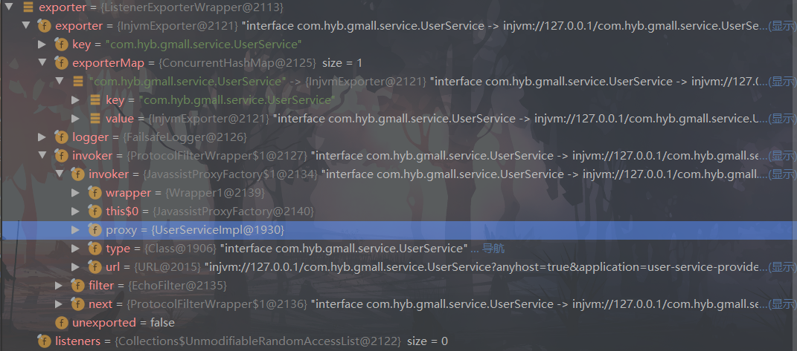

# 1、RPC原理


一次完整的RPC调用流程（同步调用，异步另说）如下： 

- 1）服务消费方（client）调用以本地调用方式调用服务；
- 2）client stub接收到调用后负责将方法、参数等组装成能够进行网络传输的消息体； 
- 3）client stub找到服务地址，并将消息发送到服务端； 
- 4）server stub收到消息后进行解码； 
- 5）server stub根据解码结果调用本地的服务； 
- 6）本地服务执行并将结果返回给server stub； 
- 7）server stub将返回结果打包成消息并发送至消费方； 
- 8）client stub接收到消息，并进行解码； 
- 9）服务消费方得到最终结果。

RPC框架的目标就是要2~8这些步骤都封装起来，这些细节对用户来说是透明的，不可见的。

# 2、netty通信原理

Netty是一个异步事件驱动的网络应用程序框架， 用于快速开发可维护的高性能协议服务器和客户端。它极大地简化并简化了TCP和UDP套接字服务器等网络编程。


Selector 一般称 为**选择器** ，也可以翻译为 **多路复用器，**

Connect（连接就绪）、Accept（接受就绪）、Read（读就绪）、Write（写就绪）

Netty基本原理：


# 3、dubbo原理

> https://dubbo.apache.org/zh/docsv2.7/dev/

## 1、dubbo原理	-框架设计 

> https://dubbo.apache.org/zh/docsv2.7/dev/design/


图例说明：

- 图中左边淡蓝背景的为服务消费方使用的接口，右边淡绿色背景的为服务提供方使用的接口，位于中轴线上的为双方都用到的接口。
- 图中从下至上分为十层，各层均为单向依赖，右边的黑色箭头代表层之间的依赖关系，每一层都可以剥离上层被复用，其中，Service 和 Config 层为 API，其它各层均为 SPI。
- 图中绿色小块的为扩展接口，蓝色小块为实现类，图中只显示用于关联各层的实现类。
- 图中蓝色虚线为初始化过程，即启动时组装链，红色实线为方法调用过程，即运行时调时链，紫色三角箭头为继承，可以把子类看作父类的同一个节点，线上的文字为调用的方法。

各层说明:

- config 配置层：对外配置接口，以 ServiceConfig, ReferenceConfig 为中心，可以直接初始化配置类，也可以通过 spring 解析配置生成配置类
- proxy 服务代理层：服务接口透明代理，生成服务的客户端 Stub 和服务器端 Skeleton, 以 ServiceProxy 为中心，扩展接口为 ProxyFactory
- registry 注册中心层：封装服务地址的注册与发现，以服务 URL 为中心，扩展接口为 RegistryFactory, Registry, RegistryService
- cluster 路由层：封装多个提供者的路由及负载均衡，并桥接注册中心，以 Invoker 为中心，扩展接口为 Cluster, Directory, Router, LoadBalance
- monitor 监控层：RPC 调用次数和调用时间监控，以 Statistics 为中心，扩展接口为 MonitorFactory, Monitor, MonitorService
- protocol 远程调用层：封装 RPC 调用，以 Invocation, Result 为中心，扩展接口为 Protocol, Invoker, Exporter
- exchange 信息交换层：封装请求响应模式，同步转异步，以 Request, Response 为中心，扩展接口为 Exchanger, ExchangeChannel, ExchangeClient, ExchangeServer
- transport 网络传输层：抽象 mina 和 netty 为统一接口，以 Message 为中心，扩展接口为 Channel, Transporter, Client, Server, Codec
- serialize 数据序列化层：可复用的一些工具，扩展接口为 Serialization, ObjectInput, ObjectOutput, ThreadPool


## 2、dubbo原理	-启动解析、加载配置信息 

Dubbo 采用 URL 的方式来作为约定的参数类型，被称为公共契约，就是我们都通过 URL 来交互，来交流。

Dubbo 利用了 Spring 配置文件扩展了自定义的解析，像 dubbo.xsd 就是用来约束 XML 配置时候的标签和对应的属性用的，然后 Spring 在解析到自定义的标签的时候会查找 spring.schemas 和 spring.handlers。


spring.schemas 就是指明了约束文件的路径     spring.handlers 指明了利用该 handler 来解析标签

```java
//com.alibaba.dubbo.config.spring.schema.DubboNamespaceHandler
//将标签对应的解析类关联起来，这样在解析到标签的时候就知道委托给对应的解析类解析，本质就是为了生成 Spring 的 BeanDefinition，然后利用 Spring 最终创建对应的对象。
public class DubboNamespaceHandler extends NamespaceHandlerSupport {

    static {
        Version.checkDuplicate(DubboNamespaceHandler.class);
    }

    @Override
    public void init() {
        registerBeanDefinitionParser("application", new DubboBeanDefinitionParser(ApplicationConfig.class, true));
        registerBeanDefinitionParser("module", new DubboBeanDefinitionParser(ModuleConfig.class, true));
        registerBeanDefinitionParser("registry", new DubboBeanDefinitionParser(RegistryConfig.class, true));
        registerBeanDefinitionParser("monitor", new DubboBeanDefinitionParser(MonitorConfig.class, true));
        registerBeanDefinitionParser("provider", new DubboBeanDefinitionParser(ProviderConfig.class, true));
        registerBeanDefinitionParser("consumer", new DubboBeanDefinitionParser(ConsumerConfig.class, true));
        registerBeanDefinitionParser("protocol", new DubboBeanDefinitionParser(ProtocolConfig.class, true));
        registerBeanDefinitionParser("service", new DubboBeanDefinitionParser(ServiceBean.class, true));
        registerBeanDefinitionParser("reference", new DubboBeanDefinitionParser(ReferenceBean.class, false));
        registerBeanDefinitionParser("annotation", new AnnotationBeanDefinitionParser());
    }

}
```


## 3、dubbo原理	-服务暴露


```java
// service 标签其实就是对应 ServiceBean，我们看下它的定义
public class ServiceBean<T> extends ServiceConfig<T> implements InitializingBean, DisposableBean, ApplicationContextAware, ApplicationListener<ContextRefreshedEvent>, BeanNameAware {
   ............
    @Override
    public void onApplicationEvent(ContextRefreshedEvent event) {
       //如果不是延迟暴露、并且还没暴露过、并且支持暴露的话就执行 export 方法，而 export 最终会调用父类的 export 方法
        if (isDelay() && !isExported() && !isUnexported()) {
            if (logger.isInfoEnabled()) {
                logger.info("The service ready on spring started. service: " + getInterface());
            }
            export();
        }
    }
    
     @Override
    @SuppressWarnings({"unchecked", "deprecation"})
    public void afterPropertiesSet() throws Exception {
        if (getProvider() == null) {//获取  Provider标签解析的属性值封装的组件
           ...............
            if (providerConfigMap != null && providerConfigMap.size() > 0) {
               ....................
                if ((protocolConfigMap == null || protocolConfigMap.size() == 0)
                        && providerConfigMap.size() > 1) { // backward compatibility
                    ..............
                } else {
                   ...............
                    if (providerConfig != null) {
                        setProvider(providerConfig);//把Provider标签的信息保存
                    }
                }
            }
        }
        if (getApplication() == null && (getProvider() == null || getProvider().getApplication() == null)) {
                .................
                if (applicationConfig != null) {
                    setApplication(applicationConfig);
                }
        }
        if (getModule() == null && (getProvider() == null || getProvider().getModule() == null)) {
            ...........
                if (moduleConfig != null) {
                    setModule(moduleConfig);
                }
        }
        if ((getRegistries() == null || getRegistries().isEmpty()) && (getProvider() == null || getProvider().getRegistries() == null || getProvider().getRegistries().isEmpty()) && (getApplication() == null || getApplication().getRegistries() == null || getApplication().getRegistries().isEmpty())) {
            .......................
                if (registryConfigs != null && !registryConfigs.isEmpty()) {
                    super.setRegistries(registryConfigs);
                }
        }
        if (getMonitor() == null && (getProvider() == null || getProvider().getMonitor() == null)
                && (getApplication() == null || getApplication().getMonitor() == null)) {
           ..................
                if (monitorConfig != null) {
                    setMonitor(monitorConfig);
                }
        }
        if ((getProtocols() == null || getProtocols().isEmpty()) && (getProvider() == null || getProvider().getProtocols() == null || getProvider().getProtocols().isEmpty())) {
            ......................
                if (protocolConfigs != null && !protocolConfigs.isEmpty()) {
                    super.setProtocols(protocolConfigs);
                }
        }
        if (getPath() == null || getPath().length() == 0) {
            if (beanName != null && beanName.length() > 0 && getInterface() != null && getInterface().length() > 0 && beanName.startsWith(getInterface())) {
                setPath(beanName);
            }
        }
        if (!isDelay()) {
            export();
        }
    }
}
```

`InitializingBean`接口为bean提供了初始化方法的方式，它只包括`afterPropertiesSet`方法，凡是继承该接口的类，**在初始化bean的时候都会执行该方法。**

 `ApplicationListener<ContextRefreshedEvent>`接口**会在 Spring IOC 容器刷新完成后(对象创建完后)调用 `onApplicationEvent` 方法**，而这个方法里面做的就是服务暴露，这就是服务暴露的启动点

```java
//com\alibaba\dubbo\config\spring\ServiceBean.java中的onApplicationEvent方法会调用export方法
public synchronized void export() {
    if (provider != null) {
        if (export == null) {
            export = provider.getExport();  //获取配置例如<dubbo:provider export="false"/>
        }
        if (delay == null) {
            delay = provider.getDelay();	//获取配置例如<dubbo:provider delay="10"/>
        }
    }
    if (export != null && !export) {	//如果不允许暴露，直接返回
        return;
    }

    if (delay != null && delay > 0) {    //如果需要延迟，则延迟暴露
        delayExportExecutor.schedule(new Runnable() {
            @Override
            public void run() {
                doExport();
            }
        }, delay, TimeUnit.MILLISECONDS);
    } else {
        doExport();		//直接暴露
    }
}

protected synchronized void doExport() {
    .....................
    doExportUrls();
    ..............
}

@SuppressWarnings({"unchecked", "rawtypes"})
private void doExportUrls() {
    //根据配置组装成注册中心相关的 URL
    //registryURLs = registry://127.0.0.1:2181/com.alibaba.dubbo.registry.RegistryService?application=user-service-provider&dubbo=2.6.2&pid=73472&registry=zookeeper&timestamp=1643974163700
    List<URL> registryURLs = loadRegistries(true); // 获取当前服务的注册中心，list，可以有多个注册中心
    for (ProtocolConfig protocolConfig : protocols) { // 遍历多个协议，每个协议当需向这些注册中心注册
        //protocolConfig = <dubbo:protocol name="dubbo" port="20882" id="dubbo" />
       doExportUrlsFor1Protocol(protocolConfig, registryURLs);
    }
}
```

可以看到 Dubbo 支持多注册中心，并且支持多个协议，一个服务如果有多个协议那么就都需要暴露，比如同时支持 dubbo 协议和 hessian 协议，那么需要将这个服务用两种协议分别向多个注册中心（如果有多个的话）暴露注册。

```java
private void doExportUrlsFor1Protocol(ProtocolConfig protocolConfig, List<URL> registryURLs) {
        String name = protocolConfig.getName();
        if (name == null || name.length() == 0) {
            name = "dubbo";
        }

        Map<String, String> map = new HashMap<String, String>();
        map.put(Constants.SIDE_KEY, Constants.PROVIDER_SIDE);
        map.put(Constants.DUBBO_VERSION_KEY, Version.getVersion());
        map.put(Constants.TIMESTAMP_KEY, String.valueOf(System.currentTimeMillis()));
        if (ConfigUtils.getPid() > 0) {
            map.put(Constants.PID_KEY, String.valueOf(ConfigUtils.getPid()));
        }
        appendParameters(map, application);
        appendParameters(map, module);
        appendParameters(map, provider, Constants.DEFAULT_KEY);
        appendParameters(map, protocolConfig);
        appendParameters(map, this);
        if (methods != null && !methods.isEmpty()) {
           .................
        }
		........
        // 暴露服务
        String contextPath = protocolConfig.getContextpath();
        if ((contextPath == null || contextPath.length() == 0) && provider != null) {
            contextPath = provider.getContextpath();
        }

        String host = this.findConfigedHosts(protocolConfig, registryURLs, map);
        Integer port = this.findConfigedPorts(protocolConfig, name, map);
        //构建出URL
    //dubbo://169.254.167.37:20882/com.hyb.gmall.service.UserService?anyhost=true&application=user-service-provider&bind.ip=169.254.167.37&bind.port=20882&default.timeout=1000&dubbo=2.6.2&generic=false&getUserAddressList.timeout=1000&interface=com.hyb.gmall.service.UserService&methods=getUserAddressList&pid=10224&side=provider&timeout=1000&timestamp=1643977132677
        URL url = new URL(name, host, port, (contextPath == null || contextPath.length() == 0 ? "" : contextPath + "/") + path, map);

        if (ExtensionLoader.getExtensionLoader(ConfiguratorFactory.class)
                .hasExtension(url.getProtocol())) {
            url = ExtensionLoader.getExtensionLoader(ConfiguratorFactory.class)
                    .getExtension(url.getProtocol()).getConfigurator(url).configure(url);
        }

        String scope = url.getParameter(Constants.SCOPE_KEY);
        // don't export when none is configured
        if (!Constants.SCOPE_NONE.toString().equalsIgnoreCase(scope)) {

            // export to local if the config is not remote (export to remote only when config is remote)
            if (!Constants.SCOPE_REMOTE.toString().equalsIgnoreCase(scope)) {
               //scope为null，进入此分支，进行本地暴露
                exportLocal(url);
            }
            // export to remote if the config is not local (export to local only when config is local)
            if (!Constants.SCOPE_LOCAL.toString().equalsIgnoreCase(scope)) {
                if (logger.isInfoEnabled()) {
                    logger.info("Export dubbo service " + interfaceClass.getName() + " to url " + url);
                }
                //如果有注册中心，会进行远程暴露
                if (registryURLs != null && !registryURLs.isEmpty()) {
                    for (URL registryURL : registryURLs) {
                        url = url.addParameterIfAbsent(Constants.DYNAMIC_KEY, registryURL.getParameter(Constants.DYNAMIC_KEY));
                        URL monitorUrl = loadMonitor(registryURL);
                        if (monitorUrl != null) {
                            url = url.addParameterAndEncoded(Constants.MONITOR_KEY, monitorUrl.toFullString());
                        }
                        if (logger.isInfoEnabled()) {
                            logger.info("Register dubbo service " + interfaceClass.getName() + " url " + url + " to registry " + registryURL);
                        }      
                        //拿具体实现类转换成invoker
                        Invoker<?> invoker = proxyFactory.getInvoker(ref, (Class) interfaceClass, registryURL.addParameterAndEncoded(Constants.EXPORT_KEY, url.toFullString()));
                        DelegateProviderMetaDataInvoker wrapperInvoker = new DelegateProviderMetaDataInvoker(invoker, this);
						//转换成Exporter
                        Exporter<?> exporter = protocol.export(wrapperInvoker);
                        exporters.add(exporter);
                    }
                } else {
                    //操作一样，直接暴露
                    Invoker<?> invoker = proxyFactory.getInvoker(ref, (Class) interfaceClass, url);
                    DelegateProviderMetaDataInvoker wrapperInvoker = new DelegateProviderMetaDataInvoker(invoker, this);
                    Exporter<?> exporter = protocol.export(wrapperInvoker);
                    exporters.add(exporter);
                }
            }
        }
        this.urls.add(url);
    }
```

### 本地暴露

```java
//本地暴露，走的是 injvm 协议，搞了个新的 URL 修改了协议
@SuppressWarnings({"unchecked", "rawtypes"})
private void exportLocal(URL url) {
    //传进来的url
    //dubbo://169.254.167.37:20882/com.hyb.gmall.service.UserService?anyhost=true&application=user-service-provider&bind.ip=169.254.167.37&bind.port=20882&default.timeout=1000&dubbo=2.6.2&generic=false&getUserAddressList.timeout=1000&interface=com.hyb.gmall.service.UserService&methods=getUserAddressList&pid=72716&side=provider&timeout=1000&timestamp=1643980136666
    if (!Constants.LOCAL_PROTOCOL.equalsIgnoreCase(url.getProtocol())) {
        //修改后的URl
        //injvm://127.0.0.1/com.hyb.gmall.service.UserService?anyhost=true&application=user-service-provider&bind.ip=169.254.167.37&bind.port=20882&default.timeout=1000&dubbo=2.6.2&generic=false&getUserAddressList.timeout=1000&interface=com.hyb.gmall.service.UserService&methods=getUserAddressList&pid=72716&side=provider&timeout=1000&timestamp=1643980136666
        URL local = URL.valueOf(url.toFullString())
                .setProtocol(Constants.LOCAL_PROTOCOL)
                .setHost(LOCALHOST)
                .setPort(0);
        ServiceClassHolder.getInstance().pushServiceClass(getServiceClass(ref));
        Exporter<?> exporter = protocol.export(
                proxyFactory.getInvoker(ref, (Class) interfaceClass, local));
        exporters.add(exporter);
        logger.info("Export dubbo service " + interfaceClass.getName() + " to local registry");
    }
}
```

```java
@Adaptive
<T> Exporter<T> export(Invoker<T> invoker) throws RpcException;
```

Protocol 的 export 方法是标注了 @ Adaptive 注解的，因此会生成代理类，然后代理类会根据 Invoker 里面的 URL 参数得知具体的协议，然后通过 Dubbo SPI 机制选择对应的实现类进行 export，而这个方法就会调用 InjvmProtocol#export 方法



从图中可以看到实际上就是具体实现类层层封装， invoker 其实是由 Javassist 创建的，具体创建过程 proxyFactory.getInvoker 。

dubbo 为什么用 javassist 而不用 jdk 动态代理是**因为 javassist 快**

可能存在同一个 JVM 内部引用自身服务的情况，因此**暴露的本地服务在内部调用的时候可以直接消费同一个 JVM 的服务避免了网络间的通信**


### 远程暴露

```java
Invoker<?> invoker = proxyFactory.getInvoker(ref, (Class) interfaceClass, registryURL.addParameterAndEncoded(Constants.EXPORT_KEY, url.toFullString()));
DelegateProviderMetaDataInvoker wrapperInvoker = new DelegateProviderMetaDataInvoker(invoker, this);

Exporter<?> exporter = protocol.export(wrapperInvoker);
exporters.add(exporter);
```

和本地暴露一样，需要封装成 Invoker ，不过这里相对而言比较复杂一些registryURL.addParameterAndEncoded(Constants.EXPORT_KEY, url.toFullString()) 将 URL 拼接成什么样子

> registry://127.0.0.1:2181/com.alibaba.dubbo.registry.RegistryService?application=user-service-provider&dubbo=2.6.2&export=dubbo%3A%2F%2F169.254.167.37%3A20882%2Fcom.hyb.gmall.service.UserService%3Fanyhost%3Dtrue%26application%3Duser-service-provider..............................

可以看到走 registry 协议，然后参数里又有 export=dubbo://，这个走 dubbo 协议，所以我们可以得知会先通过 registry 协议找到  RegistryProtocol 进行 export，并且在此方法里面还会根据 export 字段得到值然后执行 DubboProtocol 的 export 方法。

现在我们把目光聚焦到 RegistryProtocol#export 方法上，我们先过一遍整体的流程，然后再进入 doLocalExport 的解析

```java
@Override
public <T> Exporter<T> export(final Invoker<T> originInvoker) throws RpcException {
    //export invoker   进行dubbo://的暴露，并且还会打开端口等操作
    final ExporterChangeableWrapper<T> exporter = doLocalExport(originInvoker);
    //获取注册中心的URL，比如zookeeper://127.0.0.1:2181
    URL registryUrl = getRegistryUrl(originInvoker);

    //registry provider  根据url加载registry的实现类，比如这里的ZookeeperRegistry
    final Registry registry = getRegistry(originInvoker);
    //获取注册提供者的url，这就是刚才说的dubbo://
    final URL registedProviderUrl = getRegistedProviderUrl(originInvoker);

    //to judge to delay publish whether or not
    boolean register = registedProviderUrl.getParameter("register", true);
	//将提供者信息注册到服务提供者与消费者注册表中
    ProviderConsumerRegTable.registerProvider(originInvoker, registryUrl, registedProviderUrl);

    if (register) {//如果要注册
        register(registryUrl, registedProviderUrl);//想注册中心注册服务，这里是向zookeeper注册
        ProviderConsumerRegTable.getProviderWrapper(originInvoker).setReg(true);
    }

    // Subscribe the override data
    // FIXME When the provider subscribes, it will affect the scene : a certain JVM exposes the service and call the same service. Because the subscribed is cached key with the name of the service, it causes the subscription information to cover.
    // 获取订阅url
    final URL overrideSubscribeUrl = getSubscribedOverrideUrl(registedProviderUrl);
    //创建监听器，监听override
    final OverrideListener overrideSubscribeListener = new OverrideListener(overrideSubscribeUrl, originInvoker);
    overrideListeners.put(overrideSubscribeUrl, overrideSubscribeListener);
    registry.subscribe(overrideSubscribeUrl, overrideSubscribeListener);
    //Ensure that a new exporter instance is returned every time export
    return new DestroyableExporter<T>(exporter, originInvoker, overrideSubscribeUrl, registedProviderUrl);
}
```

这一步主要是将上面的 export=dubbo://... 先转换成 exporter ，然后获取注册中心的相关配置，如果需要注册则向注册中心注册，并且在 ProviderConsumerRegTable 这个表格中记录服务提供者，其实就是往一个 ConcurrentHashMap 中将塞入 invoker，key 就是服务接口全限定名，value 是一个 set，set 里面会存包装过的 invoker 

```java
public class ProviderConsumerRegTable {
    public static ConcurrentHashMap<String, Set<ProviderInvokerWrapper>> providerInvokers = new ConcurrentHashMap<String, Set<ProviderInvokerWrapper>>();
    public static ConcurrentHashMap<String, Set<ConsumerInvokerWrapper>> consumerInvokers = new ConcurrentHashMap<String, Set<ConsumerInvokerWrapper>>()
    }
```


 doLocalExport 方法内部，根据URL上 Dubbo 协议暴露出 exporter

```java
@SuppressWarnings("unchecked")
private <T> ExporterChangeableWrapper<T> doLocalExport(final Invoker<T> originInvoker) {
    String key = getCacheKey(originInvoker);
    ExporterChangeableWrapper<T> exporter = (ExporterChangeableWrapper<T>) bounds.get(key);
    if (exporter == null) {//双检查锁，dubbo里双检锁很多，主要因为有各种缓存
        synchronized (bounds) {
            exporter = (ExporterChangeableWrapper<T>) bounds.get(key);
            if (exporter == null) {
                final Invoker<?> invokerDelegete = new InvokerDelegete<T>(originInvoker, getProviderUrl(originInvoker)); //包一层invoker，用的url是Dubbo://,是通过getProviderUrl拿到的
                exporter = new ExporterChangeableWrapper<T>((Exporter<T>) protocol.export(invokerDelegete), originInvoker); //根据协议Dubbo://得到exporer
                bounds.put(key, exporter);
            }
        }
    }
    return exporter;
}
```


DubboProtocol#export 方法

```java
@Override
public <T> Exporter<T> export(Invoker<T> invoker) throws RpcException {
    //获取url，这里拿的是dubbo://169.254.167.37:20882/......
    URL url = invoker.getUrl();

    // export service.
    String key = serviceKey(url); //这里的key是com.hyb.gmall.service.UserService:20882
    DubboExporter<T> exporter = new DubboExporter<T>(invoker, key, exporterMap);
    exporterMap.put(key, exporter);

    //export an stub service for dispatching event
    ..........................................

    openServer(url);//打开server
    optimizeSerialization(url);
    return exporter;
}

private void openServer(URL url) {
    // find server.
    //key = 169.254.167.37:20882
    String key = url.getAddress();//获取ip
    //client can export a service which's only for server to invoke
    boolean isServer = url.getParameter(Constants.IS_SERVER_KEY, true);
    if (isServer) {
        ExchangeServer server = serverMap.get(key);//缓存检查，看是否有了
        if (server == null) {
            serverMap.put(key, createServer(url));//创建server
        } else {
            // server supports reset, use together with override
            server.reset(url);//有了就重置
        }
    }
}
```

里的关键其实就是打开 Server ，RPC 肯定需要远程调用，这里我们用的是 NettyServer 来监听服务

```java
private ExchangeServer createServer(URL url) {
    .................
    ExchangeServer server;
    try {
        //根据url调用对应的的server，默认是netty。并且初始化handler
        server = Exchangers.bind(url, requestHandler);
    } catch (RemotingException e) {
        throw new RpcException("Fail to start server(url: " + url + ") " + e.getMessage(), e);
    }
    ............
    return server;
}
```

Dubbo 协议的 export 主要就是根据 URL 构建出 key（例如有分组、接口名端口等等），然后 key 和 invoker 关联，关联之后存储到 DubboProtocol 的 exporterMap 中，然后如果是服务初次暴露则会创建监听服务器，默认是 NettyServer，并且会初始化各种 Handler 比如心跳啊、编解码等等。

服务暴露的过程起始于 Spring IOC 容器刷新完成之时，具体的流程就是根据配置得到 URL，再利用 Dubbo SPI 机制根据 URL 的参数选择对应的实现类，实现扩展。

通过 javassist 动态封装 ref (你写的服务实现类)，统一暴露出 Invoker 使得调用方便，屏蔽底层实现细节，然后封装成 exporter 存储起来，等待消费者的调用，并且会将 URL 注册到注册中心，使得消费者可以获取服务提供者的信息。


## 4、dubbo原理	-服务引用

我们已经得知 `Provider`将自己的服务暴露出来，注册到注册中心，而 `Consumer `无非就是通过一波操作**从注册中心得知 Provider 的信息，然后自己封装一个调用类和 Provider 进行深入地交流**。

在 `Dubbo `中一个可执行体就是 `Invoker`，所有调用都要向 Invoker 靠拢，因此可以推断出应该要先生成一个 Invoker，然后又因为框架需要往不侵入业务代码的方向发展，那我们的 Consumer 需要无感知的调用远程接口，因此需要搞个代理类，包装一下屏蔽底层的细节。


服务的引入和服务的暴露一样，也是通过 spring 自定义标签机制解析生成对应的 Bean，**Provider Service 对应解析的是 ServiceBean 而 Consumer Reference 对应的是 ReferenceBean**

```java
public class ReferenceBean<T> extends ReferenceConfig<T> implements FactoryBean, ApplicationContextAware, InitializingBean, DisposableBean {
}
```

前面服务暴露的时机是在 Spring 容器刷新完成之后开始暴露。

而服务的引入时机有两种，第一种是**饿汉式**，第二种是**懒汉式**。

- 饿汉式是通过实现 Spring 的`InitializingBean`接口中的 `afterPropertiesSet `方法，容器通过调用 `ReferenceBean `的 `afterPropertiesSet `方法时引入服务。
- 懒汉式是只有当这个服务被注入到其他类中时启动引入流程，也就是说用到了才会开始服务引入。

**默认情况下，Dubbo 使用懒汉式引入服务**，如果需要使用饿汉式，可通过配置 [dubbo:reference](https://link.juejin.cn?target=undefined) 的 init 属性开启。

### BeanFactory 、FactoryBean、ObjectFactory

`BeanFactory`、`ObjectFactory `是个工厂而`FactoryBean`是个 Bean

`BeanFactory` 其实就是 IOC 容器，有多种实现类，简单的说就是 Spring 里面的 Bean 都归它管，而`FactoryBean`也是 Bean 所以说也是归 BeanFactory 管理的。

那`FactoryBean` 是把你真实想要的 Bean 封装了一层，在真正要获取这个 Bean 的时候容器会调用 FactoryBean#getObject() 方法，而在这个方法里面你可以进行一些复杂的组装操作。这个方法就封装了真实想要的对象**复杂的创建过程**。

而 `ObjectFactory `这个是用于延迟查找的场景，它就是一个普通工厂，当得到 ObjectFactory 对象时，相当于 Bean 没有被创建，只有当 getObject() 方法时，才会触发 Bean 实例化等生命周期。

主要用于暂时性地获取某个 Bean Holder 对象，如果过早的加载，可能会引起一些意外的情况，比如当  Bean A 依赖 Bean B 时，如果过早地初始化 A，那么 B 里面的状态可能是中间状态，这时候使用 A 容易导致一些错误。

 **BeanFactory 就是 IOC 容器，FactoryBean 是特殊的 Bean, 用来封装创建比较复杂的对象，而 ObjectFactory 主要用于延迟查找的场景，延迟实例化对象**。

### 服务引入三种方式

服务的引入又分为了三种，第一种是本地引入、第二种是直接连接引入远程服务、第三种是通过注册中心引入远程服务。

- **本地引入**不知道大家是否还有印象，之前服务暴露的流程每个服务都会通过搞一个本地暴露，走 injvm 协议（当然你要是 scope = remote 就没本地引用了），因为**存在一个服务端既是 Provider 又是 Consumer 的情况，然后有可能自己会调用自己的服务**，因此就弄了一个本地引入，这样就避免了远程网络调用的开销。所以**服务引入会先去本地缓存找找看有没有本地服务**。

- **直连远程引入服务**，这个其实就是平日测试的情况下用用，不需要启动注册中心，由 Consumer 直接配置写死 Provider 的地址，然后直连即可。

- **注册中心引入远程服务**，这个就是重点了，Consumer 通过注册中心得知 Provider 的相关信息，然后进行服务的引入，这里还包括多注册中心，同一个服务多个提供者的情况，如何抉择如何封装，如何进行负载均衡、容错并且让使用者无感知

### 服务引入流程解析

默认是懒汉式的，所以服务引入的入口就是 ReferenceBean 的 getObject 方法。

```java
//com\alibaba\dubbo\config\spring\ReferenceBean.java#getObject
@Override
public Object getObject() throws Exception {
    return get();
}
//com\alibaba\dubbo\config\ReferenceConfig.java#get
public synchronized T get() {
    if (destroyed) {
        throw new IllegalStateException("Already destroyed!");
    }
    // 检测 ref 是否为空，为空则通过 init 方法创建
    if (ref == null) {
        //// init 方法主要用于处理配置，以及调用 createProxy 生成代理类
        init();
    }
    return ref;
}
```

可以看到就是调用 get 方法，如果当前还没有这个引用那么就执行 init 方法。

```java
private void init() {
    ................
 //attributes are stored by system context.
   StaticContext.getSystemContext().putAll(attributes);
   ref = createProxy(map); // 创建代理类
    // 根据服务名，ReferenceConfig，代理类构建 ConsumerModel，
    // 并将 ConsumerModel 存入到 ApplicationModel 中
   ConsumerModel consumerModel = new ConsumerModel(getUniqueServiceName(), this, ref, interfaceClass.getMethods());
   ApplicationModel.initConsumerModel(getUniqueServiceName(), consumerModel);
}
```

init 方法很长，不过大部分就是检查配置然后将配置构建成 map ，最终map属性为


进入重点方法 createProxy，从名字可以得到就是要创建的一个代理。但实际上并非如此，该方法还会调用其他方法构建以及合并 Invoker 实例

```java
@SuppressWarnings({"unchecked", "rawtypes", "deprecation"})
private T createProxy(Map<String, String> map) {
    URL tmpUrl = new URL("temp", "localhost", 0, map);//先创建一个临时URL
    final boolean isJvmRefer;
    if (isInjvm() == null) {//看是不是走本地的injvm，如果配置里写了URL，肯定不是本地
        // url 配置被指定，则不做本地引用
        if (url != null && url.length() > 0) { // if a url is specified, don't do local reference
            isJvmRefer = false;
        // 根据 url 的协议、scope 以及 injvm 等参数检测是否需要本地引用
        // 比如如果用户显式配置了 scope=local，此时 isInjvmRefer 返回 true
        } else if (InjvmProtocol.getInjvmProtocol().isInjvmRefer(tmpUrl)) {//从用map构建的URL看看参数
            // by default, reference local service if there is
            isJvmRefer = true;
        } else {
            isJvmRefer = false;
        }
    } else {
        // 获取 injvm 配置值
        isJvmRefer = isInjvm().booleanValue();
    }

    //如果是走本地的话，那么直接构建个走本地协议的 URL 然后进行服务的引入，即 refprotocol.refer，这个方法之后会做分析，本地的引入就不深入了，就是去之前服务暴露的 exporterMap 拿到服务。
    if (isJvmRefer) {
         // 生成本地引用 URL，协议为 injvm
        URL url = new URL(Constants.LOCAL_PROTOCOL, NetUtils.LOCALHOST, 0, interfaceClass.getName()).addParameters(map);
        // 调用 refer 方法构建 InjvmInvoker 实例
        invoker = refprotocol.refer(interfaceClass, url);
    } else {
        //如果不是本地，那肯定是远程了，接下来就是判断是点对点直连 provider ，还是通过注册中心拿到 provider 信息再连接 provider 了，我们分析一下配置了 url 的情况，如果配置了 url 那么不是直连的地址，就是注册中心的地址
        //如果配置里设置了URL，要么是点对点直连，要么是配置中心地址，都经过处理加入urls中
        if (url != null && url.length() > 0) { // user specified URL, could be peer-to-peer address, or register center's address.
            //当需要配置多个 url 时，可用分号进行分割，这里会进行切分
            String[] us = Constants.SEMICOLON_SPLIT_PATTERN.split(url);
            if (us != null && us.length > 0) {
                for (String u : us) {//得到配置的url进行循环
                    URL url = URL.valueOf(u);
                    if (url.getPath() == null || url.getPath().length() == 0) {
                        // 设置接口全限定名为 url 路径
                        url = url.setPath(interfaceName);
                    }
                    // 检测 url 协议是否为 registry，若是，表明用户想使用指定的注册中心
                    if (Constants.REGISTRY_PROTOCOL.equals(url.getProtocol())) {
                        //如果是注册中心地址，将map转换成查询字符串，并作为refer参数的值加入url中
                        urls.add(url.addParameterAndEncoded(Constants.REFER_KEY, StringUtils.toQueryString(map)));
                    } else {
                        //如果是点对点会合并url，移出服务提供者的一些配置
                        // 合并 url，移除服务提供者的一些配置（这些配置来源于用户配置的 url 属性），
                        // 比如线程池相关配置。并保留服务提供者的部分配置，比如版本，group，时间戳等
                        // 最后将合并后的配置设置为 url 查询字符串中。
                        urls.add(ClusterUtils.mergeUrl(url, map));
                    }
                }
            }
        } else { // assemble URL from register center's configuration
            //然后就是没配置 url 的情况，到这里肯定走的就是注册中心引入远程服务了
            List<URL> us = loadRegistries(false);//和服务暴露一样拿到注册中心的地址，区别在于参数时false，表明不是provider
            if (us != null && !us.isEmpty()) {
                for (URL u : us) {
                    URL monitorUrl = loadMonitor(u);
                    if (monitorUrl != null) {//如果配置了监控中心
                        map.put(Constants.MONITOR_KEY, URL.encode(monitorUrl.toFullString()));
                    }
                    //添加 refer 参数到 url 中，并将 url 添加到 urls 中
                    //StringUtils.toQueryString(map)返回值如下
                    //application=order-service-consumer&default.check=false&dubbo=2.0.2&interface=com.hyb.gmall.service.UserService&methods=getUserAddressList&monitor=dubbo://127.0.0.1:2181/com.alibaba.dubbo.registry.RegistryService?application=order-service-consumer&dubbo=2.0.2&pid=25876&protocol=registry&refer=application%3Dorder-service-consumer%26dubbo%3D2.0.2%26interface%3Dcom.alibaba.dubbo.monitor.MonitorService%26pid%3D25876%26register.ip%3D169.254.167.37%26timestamp%3D1644473939695&registry=zookeeper&timestamp=1644473938094&pid=25876&register.ip=169.254.167.37&retries=3&revision=*&side=consumer&timeout=5000&timestamp=1644472932405&version=*
                    //最终urls属性如下图
                    urls.add(u.addParameterAndEncoded(Constants.REFER_KEY, StringUtils.toQueryString(map)));
                }
            }
            if (urls.isEmpty()) { // 未配置注册中心，抛出异常
                throw new IllegalStateException("No such any registry to reference");
            }
        }
        //上面就是根据各种参数来组装 URL ，因为我们的自适应扩展都需要根据 URL 的参数来进行

        if (urls.size() == 1) {//单个注册中心或服务提供者(服务直连，下同)
            //调用 RegistryProtocol 的 refer 构建 Invoker 实例
            invoker = refprotocol.refer(interfaceClass, urls.get(0));
        } else {// 多个注册中心或多个服务提供者，或者两者混合
            List<Invoker<?>> invokers = new ArrayList<Invoker<?>>();
            URL registryURL = null;
            for (URL url : urls) {//多个URL就循环转换成invoker
                // 通过 refprotocol 调用 refer 构建 Invoker，refprotocol 会在运行时根据 url 协议头加载指定的 Protocol 实例，并调用实例的 refer 方法
                invokers.add(refprotocol.refer(interfaceClass, url));
                if (Constants.REGISTRY_PROTOCOL.equals(url.getProtocol())) {
                    registryURL = url; // use last registry url 用最后一个注册中心的地址
                }
            }
            if (registryURL != null) { // registry url is available
                //  如果注册中心链接不为空，则将使用 AvailableCluster
                URL u = registryURL.addParameter(Constants.CLUSTER_KEY, AvailableCluster.NAME);//指定用AvailableCluster
                //创建StaticDirectory实例，并由Cluster对多个invoker进行合并，只暴露一个invoker便于调用
                invoker = cluster.join(new StaticDirectory(u, invokers));
            } else { // not a registry url
                invoker = cluster.join(new StaticDirectory(invokers));
            }
        }
    }
	.........................
    // create service proxy
    return (T) proxyFactory.getProxy(invoker); //通过代理封装invoker，返回代理
    
   //首先根据配置检查是否为本地调用，若是，则调用 InjvmProtocol 的 refer 方法生成 InjvmInvoker 实例。若不是，则读取直连配置项，或注册中心 url，并将读取到的 url 存储到 urls 中。然后根据 urls 元素数量进行后续操作。若 urls 元素数量为1，则直接通过 Protocol 自适应拓展类构建 Invoker 实例接口。若 urls 元素数量大于1，即存在多个注册中心或服务直连 url，此时先根据 url 构建 Invoker。然后再通过 Cluster 合并多个 Invoker，最后调用 ProxyFactory 生成代理类。
}
```


先检查配置，通过配置构建一个 map ，然后利用 map 来构建 URL ，再通过 URL 上的协议利用自适应扩展机制调用对应的 protocol.refer 得到相应的 invoker 。

在有多个 URL 的时候，先遍历构建出 invoker 然后再由 StaticDirectory 封装一下，然后通过 cluster 进行合并，只暴露出一个 invoker 

然后再构建代理，封装 invoker 返回服务引用，之后 Comsumer 调用的就是这个代理类


从前面的截图我们可以看到此时的协议是 registry, 因此走的是 RegistryProtocol#refer

```java
@Override
@SuppressWarnings("unchecked")
public <T> Invoker<T> refer(Class<T> type, URL url) throws RpcException {
    //取registry参数值，并将其设置为协议头
    //zookeeper://127.0.0.1:2181/com.alibaba.dubbo.registry.RegistryService?application=order-service-consumer&dubbo=2.0..........
    url = url.setProtocol(url.getParameter(Constants.REGISTRY_KEY, Constants.DEFAULT_REGISTRY)).removeParameter(Constants.REGISTRY_KEY);
    Registry registry = registryFactory.getRegistry(url);//获取注册中心实例
    if (RegistryService.class.equals(type)) {
        return proxyFactory.getInvoker((T) registry, type, url);
    }

    // group="a,b" or group="*"  将 url 查询字符串转为 Map
    Map<String, String> qs = StringUtils.parseQueryString(url.getParameterAndDecoded(Constants.REFER_KEY));
    String group = qs.get(Constants.GROUP_KEY);// 获取 group 配置
    if (group != null && group.length() > 0) {//如果分组的话
        if ((Constants.COMMA_SPLIT_PATTERN.split(group)).length > 1
                || "*".equals(group)) {
            // 通过 SPI 加载 MergeableCluster 实例，并调用 doRefer 继续执行服务引用逻辑
            return doRefer(getMergeableCluster(), registry, type, url);
        }
    }
    // 调用 doRefer 继续执行服务引用逻辑
    return doRefer(cluster, registry, type, url);
}
```

主要就是获取注册中心实例，然后调用 doRefer 进行真正的 refer

```java
private <T> Invoker<T> doRefer(Cluster cluster, Registry registry, Class<T> type, URL url) {
    RegistryDirectory<T> directory = new RegistryDirectory<T>(type, url);// 创建 RegistryDirectory 实例
    directory.setRegistry(registry);//设置注册中心实例
    directory.setProtocol(protocol);//设置动态生成的Protocol$Adaptive
    // all attributes of REFER_KEY
    Map<String, String> parameters = new HashMap<String, String>(directory.getUrl().getParameters());
    //生成服务者消费者链接
    URL subscribeUrl = new URL(Constants.CONSUMER_PROTOCOL, parameters.remove(Constants.REGISTER_IP_KEY), 0, type.getName(), parameters);
    // 注册服务消费者，在 consumers 目录下新节点
    if (!Constants.ANY_VALUE.equals(url.getServiceInterface())
            && url.getParameter(Constants.REGISTER_KEY, true)) {
        URL registeredConsumerUrl = getRegisteredConsumerUrl(subscribeUrl, url);
        //向注册中心注册服务消费者，在customers目录下创建新结点
        registry.register(registeredConsumerUrl);
        directory.setRegisteredConsumerUrl(registeredConsumerUrl);
    }
    //再订阅注册中心的provider目录，configurators目录和routers目录，订阅好会触发DubboProtocol的refer方法
    directory.subscribe(subscribeUrl.addParameter(Constants.CATEGORY_KEY,
            Constants.PROVIDERS_CATEGORY
                    + "," + Constants.CONFIGURATORS_CATEGORY
                    + "," + Constants.ROUTERS_CATEGORY));

    Invoker invoker = cluster.join(directory);//利用cluster封装directory，其实就是封装多个invoker
    ProviderConsumerRegTable.registerConsumer(invoker, url, subscribeUrl, directory);//向提供者消费者服务表中记录这个信息
    return invoker;
}
//doRefer 方法创建一个 RegistryDirectory 实例，然后生成服务者消费者链接，并向注册中心进行注册。注册完毕后，紧接着订阅 providers、configurators、routers 等节点下的数据。完成订阅后，RegistryDirectory 会收到这几个节点下的子节点信息。由于一个服务可能部署在多台服务器上，这样就会在 providers 产生多个节点，这个时候就需要 Cluster 将多个服务节点合并为一个，并生成一个 Invoker
```

这个方法很关键，可以看到生成了` RegistryDirectory` 这个 directory 塞了注册中心实例，它自身也实现了` NotifyListener` 接口，因此**注册中心的监听其实是靠这家伙来处理的**。

然后向注册中心注册自身的信息，并且向注册中心订阅了 providers 节点、 configurators 节点 和 routers 节点，**订阅了之后 RegistryDirectory 会收到这几个节点下的信息，就会触发 DubboInvoker 的生成了，即用于远程调用的 Invoker**。

然后通过 cluster 再包装一下得到 Invoker，因此一个服务可能有多个提供者，最终在 ProviderConsumerRegTable 中记录这些信息，然后返回 Invoker。

所以我们知道` Conusmer` 是在 RegistryProtocol#refer 中向注册中心注册自己的信息，并且订阅 Provider 和配置的一些相关信息

拿到了`Provider`的信息之后就可以通过监听触发 DubboProtocol# refer 了（具体调用哪个 protocol 还是得看 URL的协议的，我们这里是 dubbo 协议），整个触发流程看下调用栈就清楚了


终于我们从注册中心拿到远程` Provider` 的信息了，然后进行服务的引入

```java
//DubboProtocol# refer 
@Override
public <T> Invoker<T> refer(Class<T> serviceType, URL url) throws RpcException {
    optimizeSerialization(url);
    // create rpc invoker. 拿到接口类 远程服务的URL 创建一个client，实例类型为 ExchangeClient
    //ExchangeClient 实际上并不具备通信能力，它需要基于更底层的客户端实例进行通信。比如 NettyClient、MinaClient 等，默认情况下，Dubbo 使用 NettyClient 进行通信
    DubboInvoker<T> invoker = new DubboInvoker<T>(serviceType, url, getClients(url), invokers);
    invokers.add(invoker);
    return invoker;
}
```

这里的重点在 `getClients`，因为终究是要跟远程服务进行网络调用的，而 getClients 就是用于获取客户端实例，实例类型为 ExchangeClient，底层依赖 Netty 来进行网络通信，并且可以看到默认是共享连接

```java
private ExchangeClient[] getClients(URL url) {
    // whether to share connection 是否共享连接
    boolean service_share_connect = false;
    //获取连接数，默认为0，表示未配置
    int connections = url.getParameter(Constants.CONNECTIONS_KEY, 0);
    // if not configured, connection is shared, otherwise, one connection for one service
    //如果未配置 connections，则共享连接
    if (connections == 0) {
        service_share_connect = true;//默认共享连接
        connections = 1;
    }

    ExchangeClient[] clients = new ExchangeClient[connections];
    for (int i = 0; i < clients.length; i++) {
        if (service_share_connect) {
            //获取共享客户端
            //通过远程地址找 client ，这个 client 还有引用计数的功能，如果该远程地址还没有 client 则调用 initClient
            clients[i] = getSharedClient(url);//返回共享的客户端
        } else {
            clients[i] = initClient(url);//得到初始化新的客户端
        }
    }
    return clients;
}
```

返回的clients为下图，这个`connect`最终返回 `HeaderExchangeClient `里面封装的是 `NettyClient`


```java
private ExchangeClient getSharedClient(URL url) {
    String key = url.getAddress();
    // 获取带有“引用计数”功能的 ExchangeClient
    ReferenceCountExchangeClient client = referenceClientMap.get(key);
    if (client != null) {
        if (!client.isClosed()) {
            // 增加引用计数
            client.incrementAndGetCount();
            return client;
        } else {
            referenceClientMap.remove(key);
        }
    }

    locks.putIfAbsent(key, new Object());
    synchronized (locks.get(key)) {
        if (referenceClientMap.containsKey(key)) {
            return referenceClientMap.get(key);
        }

        // 创建 ExchangeClient 客户端
        ExchangeClient exchangeClient = initClient(url);
        // 将 ExchangeClient 实例传给 ReferenceCountExchangeClient，这里使用了装饰模式
        client = new ReferenceCountExchangeClient(exchangeClient, ghostClientMap);
        referenceClientMap.put(key, client);
        ghostClientMap.remove(key);
        locks.remove(key);
        return client;
    }
}
```

上面方法先访问缓存，若缓存未命中，则通过 initClient 方法创建新的 ExchangeClient 实例，并将该实例传给 ReferenceCountExchangeClient 构造方法创建一个带有引用计数功能的 ExchangeClient 实例

```java
private ExchangeClient initClient(URL url) {

    // client type setting.
    //获取客户端类型，默认为netty
    String str = url.getParameter(Constants.CLIENT_KEY, url.getParameter(Constants.SERVER_KEY, Constants.DEFAULT_REMOTING_CLIENT));

    //添加编解码和心跳包到url
    url = url.addParameter(Constants.CODEC_KEY, DubboCodec.NAME);
    // enable heartbeat by default
    url = url.addParameterIfAbsent(Constants.HEARTBEAT_KEY, String.valueOf(Constants.DEFAULT_HEARTBEAT));

    // BIO is not allowed since it has severe performance issue.
    //检查是否有这个类型的客户端，不存在则抛出异常
    if (str != null && str.length() > 0 && !ExtensionLoader.getExtensionLoader(Transporter.class).hasExtension(str)) {
        throw new RpcException("Unsupported client type: ...............");
    }

    ExchangeClient client;
    try {
        // connection should be lazy 获取 lazy 配置，并根据配置值决定创建的客户端类型
        if (url.getParameter(Constants.LAZY_CONNECT_KEY, false)) {
            // 创建懒加载 ExchangeClient 实例
            client = new LazyConnectExchangeClient(url, requestHandler);
        } else {
            //创建普通 ExchangeClient 实例
            client = Exchangers.connect(url, requestHandler);//连接远程
        }
    } catch (RemotingException e) {
        throw new RpcException("Fail to create remoting client for service............");
    }
    return client;
}
```

```java
//Exchangers 的 connect 方法
public static ExchangeClient connect(URL url, ExchangeHandler handler) throws RemotingException {
    if (url == null) {
        throw new IllegalArgumentException("url == null");
    }
    if (handler == null) {
        throw new IllegalArgumentException("handler == null");
    }
    url = url.addParameterIfAbsent(Constants.CODEC_KEY, "exchange");
    // 获取 Exchanger 实例，默认为 HeaderExchangeClient
    //getExchanger 会通过 SPI 加载 HeaderExchangeClient 实例
    return getExchanger(url).connect(url, handler);
}
```

```java
public ExchangeClient connect(URL url, ExchangeHandler handler) throws RemotingException {
    // 这里包含了多个调用，分别如下：
    // 1. 创建 HeaderExchangeHandler 对象
    // 2. 创建 DecodeHandler 对象
    // 3. 通过 Transporters 构建 Client 实例
    // 4. 创建 HeaderExchangeClient 对象
    return new HeaderExchangeClient(Transporters.connect(url, new DecodeHandler(new HeaderExchangeHandler(handler))), true);
}
```

```java
// Transporters 的 connect 方法
public static Client connect(URL url, ChannelHandler... handlers) throws RemotingException {
    if (url == null) {
        throw new IllegalArgumentException("url == null");
    }
    ChannelHandler handler;
    if (handlers == null || handlers.length == 0) {
        handler = new ChannelHandlerAdapter();
    } else if (handlers.length == 1) {
        handler = handlers[0];
    } else {
        // 如果 handler 数量大于1，则创建一个 ChannelHandler 分发器
        handler = new ChannelHandlerDispatcher(handlers);
    }
    
    // 获取 Transporter 自适应拓展类，并调用 connect 方法生成 Client 实例
    //getTransporter 方法返回的是自适应拓展类，该类会在运行时根据客户端类型加载指定的 Transporter 实现类。若用户未配置客户端类型，则默认加载 NettyTransporter，并调用该类的 connect 方法
    return getTransporter().connect(url, handler);
}

public Client connect(URL url, ChannelHandler listener) throws RemotingException {
    // 创建 NettyClient 对象
    return new NettyClient(url, listener);
}
```

最终得到的 `Invoker `就是这个样子，可以看到记录的很多信息，基本上该有的都有了，我这里走的是对应的服务只有一个 url 的情况，多个 url 是利用 `directory` 和 `cluster `再封装一层。

com\alibaba\dubbo\registry\integration\RegistryProtocol.java#doRefer的返回值


最终将调用 com\alibaba\dubbo\config\ReferenceConfig.java#createProxy最后

`return (T) proxyFactory.getProxy(invoker);` 返回一个代理对象


总结地说无非就是通过配置组成 URL ，然后通过自适应得到对于的实现类进行服务引入，如果是注册中心那么会向注册中心注册自己的信息，然后订阅注册中心相关信息，得到远程 `provider `的 ip 等信息，再通过`netty`客户端进行连接。

并且通过` directory` 和  `cluster` 进行底层多个服务提供者的屏蔽、容错和负载均衡等，最终得到封装好的 `invoker `再通过动态代理封装得到代理类，让接口调用者无感知的调用方法。

>  创建代理ProxyFactory 的 getProxy  https://dubbo.apache.org/zh/docs/v2.7/dev/source/refer-service/

## 5、dubbo原理	-服务调用

### 协议

**远程调用需要定义协议，也就是互相约定我们要讲什么样的语言**

常见的三种协议

应用层一般有三种类型的协议形式，分别是：固定长度形式、特殊字符隔断形式、header+body 形式。

- **固定长度形式**：指的是协议的长度是固定的，比如100个字节为一个协议单元，那么读取100个字节之后就开始解析。

优点就是效率较高，无脑读一定长度就解析。

缺点就是死板，每次长度只能固定，不能超过限制的长度，并且短了还得填充，在 RPC 场景中不太合适，谁晓得参数啥的要多长，定长了浪费，定短了不够。

- **特殊字符隔断形式**：其实就是定义一个特殊结束符，根据特殊的结束符来判断一个协议单元的结束，比如用换行符等等。

这个协议的优点是长度自由，反正根据特殊字符来截断，缺点就是需要一直读，直到读到一个完整的协议单元之后才能开始解析，然后假如传输的数据里面混入了这个特殊字符就出错了。

- **header+body 形式**：也就是头部是固定长度的，然后头部里面会填写 body 的长度， body 是不固定长度的，这样伸缩性就比较好了，可以先解析头部，然后根据头部得到 body 的 len 然后解析 body。

dubbo 协议就是属于 header+body 形式，而且也有特殊的字符 0xdabb ，这是用来解决 TCP 网络粘包问题的。

### Dubbo协议

Dubbo 支持的协议很多


协议分为协议头和协议体，可以看到 16 字节的头部主要携带了魔法数，也就是之前说的 0xdabb，然后一些请求的设置，消息体的长度等等。

16 字节之后就是协议体了，包括协议版本、接口名字、接口版本、方法名字等等。

其实协议很重要，因为从中可以得知很多信息，而且只有懂了协议的内容，才能看得懂编码器和解码器在干嘛，我再截取一张官网对协议的解释图


### 序列化协议

**网络是以字节流的形式传输的**，相对于我们的对象来说，我们对象是多维的，而字节流是一维的，我们需要把我们的对象压缩成一维的字节流传输到对端。然后对端再反序列化这些字节流变成对象

序列化大致分为两大类，一种是字符型，一种是二进制流。

**字符型**的代表就是 XML、JSON，字符型的优点就是调试方便，它是对人友好的，我们一看就能知道那个字段对应的哪个参数。

缺点就是传输的效率低，有很多冗余的东西，比如 JSON 的括号，对于网络传输来说传输的时间变长，占用的带宽变大。

**二进制流型**，这种类型是对机器友好的，它的数据更加的紧凑，所以占用的字节数更小，传输更快。

缺点就是调试很难，肉眼是无法识别的，必须借用特殊的工具转换。

Dubbo 默认用的是 hessian2 序列化协议。

### Dubbo 服务调用过程


服务消费者通过代理对象 Proxy 发起远程调用，接着通过网络客户端 Client (默认Netty) 将编码后的请求发送给服务提供方的网络层上，也就是 Server（NettyServer）。Server 在收到请求后，首先要做的事情是对数据包进行解码。然后将解码后的请求发送至分发器 Dispatcher，再由分发器将请求派发到指定的线程池上，最后由线程池调用具体的服务。这就是一个远程调用请求的发送与接收过程。至于响应的发送与接收过程，这张图中没有表现出来。


服务端往往会有多个，多个服务端的服务就会有多个 Invoker，最终需要通过路由过滤，然后再通过负载均衡机制来选出一个 Invoker 进行调用。

 Cluster 还有容错机制，包括重试等等。

请求会先到达 Netty 的 I/O 线程池进行读写和可选的序列化和反序列化，可以通过 `decode.in.io`控制，然后通过业务线程池处理反序列化之后的对象，找到对应 Invoker 进行调用。

### 调用流程-客户端源码分析

客户端调用一下代码

```java
List<UserAddress> addressList = userService.getUserAddressList("1");
```

调用具体的接口会调用生成的代理类，而代理类会生成一个 `RpcInvocation` 对象调用 `MockClusterInvoker#invoke `方法

```java
public class InvokerInvocationHandler implements InvocationHandler {

    private final Invoker<?> invoker;

    public InvokerInvocationHandler(Invoker<?> handler) {
        this.invoker = handler;
    }

    @Override
    public Object invoke(Object proxy, Method method, Object[] args) throws Throwable {
        String methodName = method.getName();
        Class<?>[] parameterTypes = method.getParameterTypes();
        
        // 拦截定义在 Object 类中的方法（未被子类重写），比如 wait/notify
        if (method.getDeclaringClass() == Object.class) {
            return method.invoke(invoker, args);
        }
        
        // 如果 toString、hashCode 和 equals 等方法被子类重写了，这里也直接调用
        if ("toString".equals(methodName) && parameterTypes.length == 0) {
            return invoker.toString();
        }
        if ("hashCode".equals(methodName) && parameterTypes.length == 0) {
            return invoker.hashCode();
        }
        if ("equals".equals(methodName) && parameterTypes.length == 1) {
            return invoker.equals(args[0]);
        }
        
        // 将 method 和 args 封装到 RpcInvocation 中，并执行后续的调用
        return invoker.invoke(new RpcInvocation(method, args)).recreate();
    }
}
```


InvokerInvocationHandler 中的 invoker 成员变量类型为 `MockClusterInvoker`，`MockClusterInvoker `内部封装了**服务降级**逻辑。

```java
public class MockClusterInvoker<T> implements Invoker<T> {
    
    private final Invoker<T> invoker;
    
    public Result invoke(Invocation invocation) throws RpcException {
        Result result = null;

        // 获取 mock 配置值
        String value = directory.getUrl().getMethodParameter(invocation.getMethodName(), Constants.MOCK_KEY, Boolean.FALSE.toString()).trim();
        if (value.length() == 0 || value.equalsIgnoreCase("false")) {
            // 没有 mock 逻辑，直接调用其他 Invoker 对象的 invoke 方法，
            // 比如 FailoverClusterInvoker
            result = this.invoker.invoke(invocation);
        } else if (value.startsWith("force")) {
            // force:xxx 直接执行 mock 逻辑，不发起远程调用
            result = doMockInvoke(invocation, null);
        } else {
            // fail:xxx 表示消费方对调用服务失败后，再执行 mock 逻辑，不抛出异常
            try {
                // 调用其他 Invoker 对象的 invoke 方法
                result = this.invoker.invoke(invocation);
            } catch (RpcException e) {
                if (e.isBiz()) {
                    throw e;
                } else {
                    // 调用失败，执行 mock 逻辑
                    result = doMockInvoke(invocation, e);
                }
            }
        }
        return result;
    }
    
    // 省略其他方法
}
```

可以看到就是判断配置里面有没有配置 mock。来看看 this.invoker.invoke(invocation)的实现，实际上会调用 AbstractClusterInvoker#invoke

```java
public abstract class AbstractClusterInvoker<T> implements Invoker<T> {
    
    public Result invoke(final Invocation invocation) throws RpcException {
        checkWhetherDestroyed();//检查是否被销毁
        LoadBalance loadbalance = null;

        // binding attachments into invocation.
        // 看看上下文中有没有attachments ，有的话绑定到invocation.
        Map<String, String> contextAttachments = RpcContext.getContext().getAttachments();
        if (contextAttachments != null && contextAttachments.size() != 0) {
            ((RpcInvocation) invocation).addAttachments(contextAttachments);
        }

        List<Invoker<T>> invokers = list(invocation);//这个实际上调用的就是directory.list. 里面做的是路由过滤
        if (invokers != null && !invokers.isEmpty()) {//过滤完后哈游invoker通过，通过SPI获取loadbalance的实现类
            loadbalance = ExtensionLoader.getExtensionLoader(LoadBalance.class).getExtension(invokers.get(0).getUrl()
                    .getMethodParameter(RpcUtils.getMethodName(invocation), Constants.LOADBALANCE_KEY, Constants.DEFAULT_LOADBALANCE));
        }
        RpcUtils.attachInvocationIdIfAsync(getUrl(), invocation);
        return doInvoke(invocation, invokers, loadbalance);//调用子类方法
    }

    protected List<Invoker<T>> list(Invocation invocation) throws RpcException {
        List<Invoker<T>> invokers = directory.list(invocation);
        return invokers;
    }
}
```

**模板方法：其实就是在抽象类中定好代码的执行骨架，然后将具体的实现延迟到子类中，由子类来自定义个性化实现，也就是说可以在不改变整体执行步骤的情况下修改步骤里面的实现，减少了重复的代码，也利于扩展，符合开闭原则。**

在代码中就是那个 `doInvoke`由子类来实现，上面的一些步骤都是每个子类都要走的，所以抽到抽象类中


路由和负载均衡得到 Invoker

`list(invocation)`，实际上调用的就是directory.list，其实就是通过方法名找 Invoker，然后服务的路由过滤一波，也有再造一个 MockInvoker 的

```java
//com\alibaba\dubbo\rpc\cluster\support\AbstractClusterInvoker.java
protected List<Invoker<T>> list(Invocation invocation) throws RpcException {
    List<Invoker<T>> invokers = directory.list(invocation);
    return invokers;
}

//com\alibaba\dubbo\rpc\cluster\directory\AbstractDirectory.java
 public List<Invoker<T>> list(Invocation invocation) throws RpcException {
        if (destroyed) {
            throw new RpcException("Directory already destroyed .url: " + getUrl());
        }
        List<Invoker<T>> invokers = doList(invocation);//这里也是子类实现，通过方法名找到对应的invoker
        List<Router> localRouters = this.routers; // local reference
        if (localRouters != null && !localRouters.isEmpty()) {
            for (Router router : localRouters) {
                try {//获取runtime 参数，根据参数决定是否进行路由
                    if (router.getUrl() == null || router.getUrl().getParameter(Constants.RUNTIME_KEY, false)) {
                        invokers = router.route(invokers, getConsumerUrl(), invocation);
                    }
                } catch (Throwable t) {
                    logger.error("Failed to execute router: " + getUrl() + ", cause: " + t.getMessage(), t);
                }
            }
        }
        return invokers;
    }
```

然后带着这些 Invoker 再进行一波 loadbalance 的挑选，得到一个 Invoker，我们默认使用的是 `FailoverClusterInvoker`，也就是失败自动切换的容错方式。总结一下就是 **FailoverClusterInvoker 拿到 Directory 返回的 Invoker 列表，并且经过路由之后，它会让 LoadBalance 从 Invoker 列表中选择一个 Invoker**。

最后`FailoverClusterInvoker`会将参数传给选择出的那个 Invoker 实例的 invoke 方法，进行真正的远程调用，来看下 FailoverClusterInvoker#doInvoke,为方便删了很多

```java
com\alibaba\dubbo\rpc\cluster\support\FailoverClusterInvoker.java
@Override
@SuppressWarnings({"unchecked", "rawtypes"})
public Result doInvoke(Invocation invocation, final List<Invoker<T>> invokers, LoadBalance loadbalance) throws RpcException {
        ........
        Set<String> providers = new HashSet<String>(len);
        for (int i = 0; i < len; i++) {//重试次数
       		//负载均衡选择一个invoker
            Invoker<T> invoker = select(loadbalance, invocation, copyinvokers, invoked);
            invoked.add(invoker);
            RpcContext.getContext().setInvokers((List) invoked);//上下文保存调用过的invoker
            try {
                Result result = invoker.invoke(invocation);//发起调用
                return result;
            } catch (RpcException e) {
                .................
            } finally {
                providers.add(invoker.getUrl().getAddress());
            }
        }
        throw new RpcException("Failed to invoke the method ");
    }

}    
```

发起调用的这个 invoke 又是调用抽象类中的 invoke 然后再调用子类的 doInvoker，直接看子类 DubboInvoker 的 doInvoke 方法。

```java
  protected Result doInvoke(final Invocation invocation) throws Throwable {
        RpcInvocation inv = (RpcInvocation) invocation;
        final String methodName = RpcUtils.getMethodName(invocation);
        // 设置 path 和 version 到 attachment 中
        inv.setAttachment(Constants.PATH_KEY, getUrl().getPath());
        inv.setAttachment(Constants.VERSION_KEY, version);

        ExchangeClient currentClient;
        if (clients.length == 1) {
            // 从 clients 数组中获取 ExchangeClient
            currentClient = clients[0];
        } else {
            currentClient = clients[index.getAndIncrement() % clients.length];
        }
        try {
            // 获取异步配置，是否异步调用
            boolean isAsync = RpcUtils.isAsync(getUrl(), invocation);
            // isOneway 为 true，表示“单向”通信
            boolean isOneway = RpcUtils.isOneway(getUrl(), invocation);
            //获取超时时间
            int timeout = getUrl().getMethodParameter(methodName, Constants.TIMEOUT_KEY, Constants.DEFAULT_TIMEOUT);

            // 异步无返回值
            if (isOneway) {
                boolean isSent = getUrl().getMethodParameter(methodName, Constants.SENT_KEY, false);
                // 发送请求
                currentClient.send(inv, isSent);
                // 设置上下文中的 future 字段为 null
                RpcContext.getContext().setFuture(null);//future直接是空
                // 返回一个空的 RpcResult
                return new RpcResult();
            } 

            // 异步有返回值
            else if (isAsync) {
                // 发送请求，并得到一个 ResponseFuture 实例
                ResponseFuture future = currentClient.request(inv, timeout);
                // 设置 future 到上下文中
                RpcContext.getContext().setFuture(new FutureAdapter<Object>(future));
                // 暂时返回一个空结果
                return new RpcResult();
            } 

            // 同步调用
            else {
                RpcContext.getContext().setFuture(null);
                // 发送请求，得到一个 ResponseFuture 实例，并调用该实例的 get 方法进行等待
                return (Result) currentClient.request(inv, timeout).get();
            }
        } catch (TimeoutException e) {
            throw new RpcException(..., "Invoke remote method timeout....");
        } catch (RemotingException e) {
            throw new RpcException(..., "Failed to invoke remote method: ...");
        }
    }
```

### 调用的三种方式

从上面的代码可以看到调用一共分为三种，分别是 **oneway、异步、同步**。

- **oneway**还是很常见的，就是当你不关心你的请求是否发送成功的情况下，就用 oneway 的方式发送，这种方式消耗最小，啥都不用记，啥都不用管。 
- **异步调用**，其实 Dubbo 天然就是异步的，可以看到 client 发送请求之后会得到一个 ResponseFuture，然后把 future 包装一下塞到上下文中，这样用户就可以从上下文中拿到这个 future，然后用户可以做了一波操作之后再调用 future.get 等待结果。
- **同步调用**，这是我们最常用的，也就是 Dubbo 框架帮助我们异步转同步了，从代码可以看到在 Dubbo 源码中就调用了 `future.get`，所以给用户的感觉就是我调用了这个接口的方法之后就阻塞住了，必须要等待结果到了之后才能返回，所以就是同步的。

可以看到 Dubbo 本质上就是异步的，为什么有同步就是因为框架帮我们转了一下，而**同步和异步的区别其实就是`future.get` 在用户代码被调用还是在框架代码被调用**。

再回到源码中来，currentClient.request 源码如下就是组装 request 然后构造一个 future 然后调用 NettyClient 发送请求。

```java
//com\alibaba\dubbo\remoting\exchange\support\header\HeaderExchangeChannel.java
@Override
public ResponseFuture request(Object request, int timeout) throws RemotingException {
    if (closed) {
        throw new RemotingException(this.getLocalAddress(), null, "Failed to send request " + request + ", cause: The channel " + this + " is closed!");
    }
    // create request.  构造request
    Request req = new Request();
    req.setVersion(Version.getProtocolVersion());
    req.setTwoWay(true);
    req.setData(request);
    DefaultFuture future = new DefaultFuture(channel, req, timeout);//ResponseFuture的实现类
    try {
        channel.send(req); //利用NettyClient的send方法发送请求
    } catch (RemotingException e) {
        future.cancel();
        throw e;
    }
    return future;
}
```

看一下 `DefaultFuture` 的内部，因为是异步，那么这个 future 保存了之后，等响应回来了如何找到对应的 future 呢？就是利用一个唯一 ID。

```java
public class Request {

    private static final AtomicLong INVOKE_ID = new AtomicLong(0);
    
    public Request() {//默认构造器调用newId
        mId = newId();
    }

    private static long newId() {// getAndIncrement() When it grows to MAX_VALUE, it will grow to MIN_VALUE, and the negative can be used as ID 静态变量++，构造唯一id
        return INVOKE_ID.getAndIncrement();
    }
}
public class DefaultFuture implements ResponseFuture {
    
    private static final Map<Long, Channel> CHANNELS = new ConcurrentHashMap<Long, Channel>();

    private static final Map<Long, DefaultFuture> FUTURES = new ConcurrentHashMap<Long, DefaultFuture>();
    
    public DefaultFuture(Channel channel, Request request, int timeout) {
        this.channel = channel;
        this.request = request;
        
        // 获取请求 id，这个 id 很重要，后面还会见到
        this.id = request.getId();
        this.timeout = timeout > 0 ? timeout : channel.getUrl().getPositiveParameter(Constants.TIMEOUT_KEY, Constants.DEFAULT_TIMEOUT);
        // 存储 <requestId, DefaultFuture> 映射关系到 FUTURES 中  ConcurentHashMap
        FUTURES.put(id, this);
        CHANNELS.put(id, channel);
    }
}
```

可以看到 Request 会生成一个全局唯一 ID，然后 future 内部会将自己和 ID 存储到一个 ConcurrentHashMap。这个 ID 发送到服务端之后，服务端也会把这个 ID 返回来，这样通过这个 ID 再去ConcurrentHashMap 里面就可以找到对应的 future 。最终会调用 `DefaultFuture#received `的方法


```java
public static void received(Channel channel, Response response) {//接收到响应，调用received
    try {
        DefaultFuture future = FUTURES.remove(response.getId());//根据id在map中找对应的future
        if (future != null) {
            future.doReceived(response);//doReceived
        } else {
            logger.warn("The timeout response finally returned at ");
        }
    } finally {
        CHANNELS.remove(response.getId());
    }
}

private void doReceived(Response res) {
        lock.lock();
        try {
            response = res;//响应赋值
            if (done != null) {
                done.signal();//通知来响应了
            }
        } finally {
            lock.unlock();
        }
        if (callback != null) {
            invokeCallback(callback);
        }
    }
```


发起请求的调用链如下图：


处理请求响应的调用链如下图所示：


### 调用流程-服务端端源码分析

服务端接收到请求之后就会解析请求得到消息，这消息又有五种派发策略：


默认走的是 all，也就是所有消息都派发到业务线程池中，来看下 AllChannelHandler 的实现

```java
@Override
    public void received(Channel channel, Object message) throws RemotingException {
        ExecutorService cexecutor = getExecutorService();//获取线程池
        try {
            cexecutor.execute(new ChannelEventRunnable(channel, handler, ChannelState.RECEIVED, message));
        } catch (Throwable t) {
            //如果抛出错误
        	if(message instanceof Request && t instanceof RejectedExecutionException){
        		Request request = (Request)message;
        		if(request.isTwoWay()){//如果需要返回响应，封装错误到response
        			String msg = "Server side(" + url.getIp() + "," + url.getPort() + ") threadpool is exhausted ,detail msg:" + t.getMessage();
        			Response response = new Response(request.getId(), request.getVersion());
        			response.setStatus(Response.SERVER_THREADPOOL_EXHAUSTED_ERROR);
        			response.setErrorMessage(msg);
        			channel.send(response);
        			return;
        		}
        	}
            throw new ExecutionException( " error when process received event .");
        }
    }

```

就是将消息封装成一个 ChannelEventRunnable 扔到业务线程池中执行，ChannelEventRunnable 里面会根据 ChannelState 调用对于的处理方法，这里是 `ChannelState.RECEIVED`，所以调用 `handler.received`，最终会调用 HeaderExchangeHandler#handleRequest

```java
Response handleRequest(ExchangeChannel channel, Request req) throws RemotingException {
    Response res = new Response(req.getId(), req.getVersion());//通过请求id创建一个response
    if (req.isBroken()) {
      ......
    }
    // find handler by message class.
    Object msg = req.getData();//获取请求的信息，方法名什么的
    try {
        // handle data.
        Object result = handler.reply(channel, msg);//最终调用DubboProtocol的reply方法
        res.setStatus(Response.OK);
        res.setResult(result);
    } catch (Throwable e) {
        res.setStatus(Response.SERVICE_ERROR);
        res.setErrorMessage(StringUtils.toString(e));
    }
    return res;
}
```

DubboProtocol的reply方法

```java
public Object reply(ExchangeChannel channel, Object message) throws RemotingException {
    if (message instanceof Invocation) {
        Invocation inv = (Invocation) message;
        Invoker<?> invoker = getInvoker(channel, inv);//根据inv得到对应的invoker
        // need to consider backward-compatibility if it's a callback
        if (Boolean.TRUE.toString().equals(inv.getAttachments().get(IS_CALLBACK_SERVICE_INVOKE))) {
            //回调逻辑
        }
        RpcContext.getContext().setRemoteAddress(channel.getRemoteAddress());
        return invoker.invoke(inv);//调用选择的invoker
    }
    throw new RemotingException("Unsupported request: ");
}
```

最后的调用实际上会调用一个 Javassist 生成的代理类，里面包含了真正的实现类，再来看看`getInvoker` 这个方法，看看怎么根据请求的信息找到对应的 invoker 的。

```java
Invoker<?> getInvoker(Channel channel, Invocation inv) throws RemotingException {
    ......
    String serviceKey = serviceKey(port, path, inv.getAttachments().get(Constants.VERSION_KEY), inv.getAttachments().get(Constants.GROUP_KEY));

    DubboExporter<?> exporter = (DubboExporter<?>) exporterMap.get(serviceKey);//之前服务暴露的map

    if (exporter == null)
        throw new RemotingException("Not found exported service: ");

    return exporter.getInvoker();//返回invoker
}
```

关键就是那个 serviceKey， 之前服务暴露将invoker 封装成 exporter 之后再构建了一个 serviceKey将其和 exporter 存入exporterMap 中，这 map 这个时候就起作用了


找到 invoker 最终调用实现类具体的方法再返回响应整个流程就完结了


首先客户端调用接口的某个方法，实际调用的是**代理类**，代理类会通过 cluster 从 directory 中获取一堆 invokers(如果有一堆的话)，然后进行 router 的过滤（其中看配置也会添加 mockInvoker 用于服务降级），然后再通过 SPI 得到 loadBalance 进行一波负载均衡。

默认的 cluster 是 FailoverCluster ，会进行容错重试处理。

现在已经得到要调用的远程服务对应的 invoker 了，此时根据具体的协议构造请求头，然后将参数根据具体的序列化协议序列化之后构造塞入请求体中，再通过 NettyClient 发起远程调用。

服务端 NettyServer 收到请求之后，根据协议得到信息并且反序列化成对象，再按照派发策略派发消息，默认是 All，扔给业务线程池。

业务线程会根据消息类型判断然后得到 serviceKey 从之前服务暴露生成的 exporterMap 中得到对应的 Invoker ，然后调用真实的实现类。

最终将结果返回，因为请求和响应都有一个统一的 ID， 客户端根据响应的 ID 找到存储起来的 Future， 然后塞入响应再唤醒等待 future 的线程，完成一次远程调用全过程。


# 4、SPI

> https://dubbo.apache.org/zh/docs/v2.7/dev/source/dubbo-spi/

## JAVA SPI

SPI 全称为 Service Provider Interface，是一种服务发现机制。SPI 的本质是将接口实现类的全限定名配置在文件中，并由服务加载器读取配置文件，加载实现类。这样可以在运行时，动态为接口替换实现类。正因此特性，我们可以很容易的通过 SPI 机制为我们的程序提供拓展功能。SPI 机制在第三方框架中也有所应用，比如 Dubbo 就是通过 SPI 机制加载所有的组件。不过，Dubbo 并未使用 Java 原生的 SPI 机制，而是对其进行了增强，使其能够更好的满足需求。

```java
public interface Robot {
    void sayHello();
}
```

```java
public class OptimusPrime implements Robot {
    
    @Override
    public void sayHello() {
        System.out.println("Hello, I am Optimus Prime.");
    }
}

public class Bumblebee implements Robot {

    @Override
    public void sayHello() {
        System.out.println("Hello, I am Bumblebee.");
    }
}
```

接下来 META-INF/services 文件夹下创建一个文件，名称为 Robot 的全限定名 com.hyb.spi.Robot。文件内容为实现类的全限定的类名

```fallback
com.hyb.spi.impl.OptimusPrime
com.hyb.spi.impl.Bumblebee
```

```java
public class test {
    @Test
    public void test1() {
        ServiceLoader<Robot> serviceLoader = ServiceLoader.load(Robot.class);
        System.out.println("Java SPI");
        serviceLoader.forEach(Robot::sayHello);
    }
}
```

```xml
Java SPI
Hello, I am Optimus Prime.
Hello, I am Bumblebee.
```

## Dubbo SPI

### 样例

Dubbo 并未使用 Java SPI，而是重新实现了一套功能更强的 SPI 机制。Dubbo SPI 的相关逻辑被封装在了 ExtensionLoader 类中，通过 ExtensionLoader，我们可以加载指定的实现类。Dubbo SPI 所需的配置文件需放置在 META-INF/dubbo 路径下,名称为 Robot 的全限定名 com.hyb.spi.Robot，配置内容如下

```xml
optimusPrime = com.hyb.spi.impl.OptimusPrime
bumblebee = com.hyb.spi.impl.Bumblebee
```

```java
@Test
public void sayHello() throws Exception {
    ExtensionLoader<Robot> extensionLoader = ExtensionLoader.getExtensionLoader(Robot.class);
    Robot optimusPrime = extensionLoader.getExtension("optimusPrime");
    optimusPrime.sayHello();
    Robot bumblebee = extensionLoader.getExtension("bumblebee");
    bumblebee.sayHello();
}
```

```xml
Hello, I am Optimus Prime.
Hello, I am Bumblebee.
```

### 源码分析

简单演示了 Dubbo SPI 的使用方法。首先通过 ExtensionLoader 的 getExtensionLoader 方法获取一个 ExtensionLoader 实例，然后再通过 ExtensionLoader 的 getExtension 方法获取拓展类对象。这其中，getExtensionLoader 方法用于从缓存中获取与拓展类对应的 ExtensionLoader，若缓存未命中，则创建一个新的实例。

```java
@SuppressWarnings("unchecked")
public static <T> ExtensionLoader<T> getExtensionLoader(Class<T> type) {
    //type interface com.hyb.spi.Robot
    if (type == null)
        throw new IllegalArgumentException("Extension type == null");
    if (!type.isInterface()) {
        throw new IllegalArgumentException("Extension type(" + type + ") is not interface!");
    }
    if (!withExtensionAnnotation(type)) {
        throw new IllegalArgumentException("Extension type(" + type +
                ") is not extension, because WITHOUT @" + SPI.class.getSimpleName() + " Annotation!");
    }

    ExtensionLoader<T> loader = (ExtensionLoader<T>) EXTENSION_LOADERS.get(type);
    if (loader == null) {
        EXTENSION_LOADERS.putIfAbsent(type, new ExtensionLoader<T>(type));
        loader = (ExtensionLoader<T>) EXTENSION_LOADERS.get(type);
    }
    //loader org.apache.dubbo.common.extension.ExtensionLoader[com.hyb.spi.Robot]
    return loader;
}
```

下面我们从 ExtensionLoader 的 getExtension 方法作为入口，对拓展类对象的获取过程进行详细的分析

```java
@SuppressWarnings("unchecked")
public T getExtension(String name) {
    if (name == null || name.length() == 0)
        throw new IllegalArgumentException("Extension name == null");
    if ("true".equals(name)) {
        // 获取默认的拓展实现类
        return getDefaultExtension();
    }
    // Holder，顾名思义，用于持有目标对象
    ////首先检查缓存，缓存未命中则创建拓展对象
    Holder<Object> holder = cachedInstances.get(name);
    if (holder == null) { //没有就新建一个
        cachedInstances.putIfAbsent(name, new Holder<Object>());
        holder = cachedInstances.get(name);
    }
    Object instance = holder.get();
    // 双重检查
    if (instance == null) {
        synchronized (holder) {
            instance = holder.get();
            if (instance == null) {
                // 创建拓展实例
                instance = createExtension(name);
                // 设置实例到 holder 中
                holder.set(instance);
            }
        }
    }
    return (T) instance;
}
```

看看如何创建的

```java
private T createExtension(String name) {
    // 从配置文件中加载所有的拓展类，可得到“配置项名称”到“配置类”的映射关系表
    //通过名称获取拓展类之前，首先需要根据配置文件解析出拓展项名称到拓展类的映射关系表（Map<名称, 拓展类>），之后再根据拓展项名称从映射关系表中取出相应的拓展类即可。
    //getExtensionClasses()得到一个Map<String, Class<?>>
    //key=optimusprime value=class com.hyb.spi.impl.OptimusPrime
    //key=bumblebee value=class com.hyb.spi.impl.Bumblebee
    Class<?> clazz = getExtensionClasses().get(name);
    if (clazz == null) {
        throw findException(name);
    }
    try {
        T instance = (T) EXTENSION_INSTANCES.get(clazz);//看看缓存是否有实例
        if (instance == null) {
            // 通过反射创建实例
            EXTENSION_INSTANCES.putIfAbsent(clazz, clazz.newInstance());
            instance = (T) EXTENSION_INSTANCES.get(clazz);
        }
        // 向实例中注入依赖（setter方法注入）
        injectExtension(instance);
        Set<Class<?>> wrapperClasses = cachedWrapperClasses;
        if (wrapperClasses != null && !wrapperClasses.isEmpty()) {//如果有包装类就包装一下
            // 循环创建 Wrapper 实例
            for (Class<?> wrapperClass : wrapperClasses) {
                // 将当前 instance 作为参数传给 Wrapper 的构造方法，并通过反射创建 Wrapper 实例。
                // 然后向 Wrapper 实例中注入依赖，最后将 Wrapper 实例再次赋值给 instance 变量
                instance = injectExtension(
                    (T) wrapperClass.getConstructor(type).newInstance(instance));
            }
        }
        return instance;
    } catch (Throwable t) {
        throw new IllegalStateException("...");
    }
}
```

createExtension 方法的逻辑稍复杂一下，包含了如下的步骤：

1. 通过 getExtensionClasses 获取所有的拓展类
2. 通过反射创建拓展对象
3. 向拓展对象中注入依赖
4. 将拓展对象包裹在相应的 Wrapper 对象中

第一个步骤是加载拓展类的关键，第三和第四个步骤是 Dubbo IOC 与 AOP 的具体实现

#### 获取所有拓展类

```java
//在通过名称获取拓展类之前，首先需要根据配置文件解析出拓展项名称到拓展类的映射关系表（Map<名称, 拓展类>），之后再根据拓展项名称从映射关系表中取出相应的拓展类即可
private Map<String, Class<?>> getExtensionClasses() {
    // 从缓存中获取已加载的拓展类
    Map<String, Class<?>> classes = cachedClasses.get();
    // 双重检查
    if (classes == null) {
        synchronized (cachedClasses) {
            classes = cachedClasses.get();
            if (classes == null) {
                // 加载拓展类
                classes = loadExtensionClasses();
                cachedClasses.set(classes);
            }
        }
    }
    return classes;
}
```

这里也是先检查缓存，若缓存未命中，则通过 synchronized 加锁。加锁后再次检查缓存，并判空。此时如果 classes 仍为 null，则通过 loadExtensionClasses 加载拓展类。下面分析 loadExtensionClasses 方法的逻辑

```java
private Map<String, Class<?>> loadExtensionClasses() {
    // 获取 SPI 注解，这里的 type 变量是在调用 getExtensionLoader 方法时传入的
    final SPI defaultAnnotation = type.getAnnotation(SPI.class);
    if (defaultAnnotation != null) {
        String value = defaultAnnotation.value();
        if ((value = value.trim()).length() > 0) {
            // 对 SPI 注解内容进行切分
            String[] names = NAME_SEPARATOR.split(value);
            // 检测 SPI 注解内容是否合法，不合法则抛出异常
            if (names.length > 1) {
                throw new IllegalStateException("more than 1 default extension name on extension...");
            }

            // 设置默认名称，参考 getDefaultExtension 方法
            if (names.length == 1) {
                cachedDefaultName = names[0];
            }
        }
    }

    Map<String, Class<?>> extensionClasses = new HashMap<String, Class<?>>();
    // 加载指定文件夹下的配置文件
    // private static final String DUBBO_INTERNAL_DIRECTORY = DUBBO_DIRECTORY + "internal/";
    loadDirectory(extensionClasses, DUBBO_INTERNAL_DIRECTORY);
    // private static final String DUBBO_DIRECTORY = "META-INF/dubbo/";
    loadDirectory(extensionClasses, DUBBO_DIRECTORY);
    // private static final String SERVICES_DIRECTORY = "META-INF/services/";
    loadDirectory(extensionClasses, SERVICES_DIRECTORY);
    return extensionClasses;
}
```

loadExtensionClasses 方法总共做了两件事情，一是对 SPI 注解进行解析，二是调用 loadDirectory 方法加载指定文件夹配置文件。SPI 注解解析过程比较简单，无需多说。下面我们来看一下 loadDirectory 做了哪些事情。

```java
private void loadDirectory(Map<String, Class<?>> extensionClasses, String dir) {
    // fileName = 文件夹路径 + type 全限定名 
    // fileName = META-INF/dubbo/com.hyb.spi.Robot
    String fileName = dir + type.getName();
    try {
        Enumeration<java.net.URL> urls;
        ClassLoader classLoader = findClassLoader();
        // 根据文件名加载所有的同名文件
        if (classLoader != null) {
            urls = classLoader.getResources(fileName);
        } else {
            urls = ClassLoader.getSystemResources(fileName);
        }
        if (urls != null) {
            while (urls.hasMoreElements()) {
             //resourceURL = file:/E:/IdeaProjects/dubbo/spi/target/classes/META-INF/dubbo/com.hyb.spi.Robot
                java.net.URL resourceURL = urls.nextElement();
                // 加载资源
                loadResource(extensionClasses, classLoader, resourceURL);
            }
        }
    } catch (Throwable t) {
        logger.error("...");
    }
}
```

loadDirectory 方法先通过 classLoader 获取所有资源链接，然后再通过 loadResource 方法加载资源。我们继续跟下去，看一下 loadResource 方法的实现。

```java
private void loadResource(Map<String, Class<?>> extensionClasses, 
	ClassLoader classLoader, java.net.URL resourceURL) {
    try {
        BufferedReader reader = new BufferedReader(
            new InputStreamReader(resourceURL.openStream(), "utf-8"));
        try {
            String line;
            // 按行读取配置内容
            //optimusPrime = com.hyb.spi.impl.OptimusPrime
            //bumblebee = com.hyb.spi.impl.Bumblebee
            while ((line = reader.readLine()) != null) {
                // 定位 # 字符
                final int ci = line.indexOf('#');
                if (ci >= 0) {
                    // 截取 # 之前的字符串，# 之后的内容为注释，需要忽略
                    line = line.substring(0, ci);
                }
                line = line.trim();
                if (line.length() > 0) {
                    try {
                        String name = null;
                        int i = line.indexOf('=');
                        if (i > 0) {
                            // 以等于号 = 为界，截取键与值
                            name = line.substring(0, i).trim();
                            line = line.substring(i + 1).trim();
                        }
                        if (line.length() > 0) {
                            // 加载类，并通过 loadClass 方法对类进行缓存
                            loadClass(extensionClasses, resourceURL, 
                                      Class.forName(line, true, classLoader), name);
                        }
                    } catch (Throwable t) {
                        IllegalStateException e = new IllegalStateException("Failed to load extension class...");
                    }
                }
            }
        } finally {
            reader.close();
        }
    } catch (Throwable t) {
        logger.error("Exception when load extension class...");
    }
}
```

loadResource 方法用于读取和解析配置文件，并通过反射加载类，最后调用 loadClass 方法进行其他操作。loadClass 方法用于主要用于操作缓存，该方法的逻辑如下：

```java
private void loadClass(Map<String, Class<?>> extensionClasses, java.net.URL resourceURL, 
    Class<?> clazz, String name) throws NoSuchMethodException {
    
    if (!type.isAssignableFrom(clazz)) {
        throw new IllegalStateException("...");
    }

    // 检测目标类上是否有 Adaptive 注解
    //clazz = class com.hyb.spi.impl.Bumblebee
    if (clazz.isAnnotationPresent(Adaptive.class)) {
        if (cachedAdaptiveClass == null) {
            // 设置 cachedAdaptiveClass缓存
            cachedAdaptiveClass = clazz;
        } else if (!cachedAdaptiveClass.equals(clazz)) {
            throw new IllegalStateException("...");
        }
        
    // 检测 clazz 是否是 Wrapper 类型，是就缓存
    } else if (isWrapperClass(clazz)) {
        Set<Class<?>> wrappers = cachedWrapperClasses;
        if (wrappers == null) {
            cachedWrapperClasses = new ConcurrentHashSet<Class<?>>();
            wrappers = cachedWrapperClasses;
        }
        // 存储 clazz 到 cachedWrapperClasses 缓存中
        wrappers.add(clazz);
        
    // 程序进入此分支，表明 clazz 是一个普通的拓展类
    } else {
        // 检测 clazz 是否有默认的构造方法，如果没有，则抛出异常
        clazz.getConstructor();
        if (name == null || name.length() == 0) {
            // 如果 name 为空，则尝试从 Extension 注解中获取 name，或使用小写的类名作为 name
            name = findAnnotationName(clazz);
            if (name.length() == 0) {
                throw new IllegalStateException("...");
            }
        }
        // 切分 name
        String[] names = NAME_SEPARATOR.split(name);
        if (names != null && names.length > 0) {
            Activate activate = clazz.getAnnotation(Activate.class);
            if (activate != null) {
                // 如果类上有 Activate 注解，则使用 names 数组的第一个元素作为键，
                // 存储 name 到 Activate 注解对象的映射关系
                cachedActivates.put(names[0], activate);
            }
            for (String n : names) {
                if (!cachedNames.containsKey(clazz)) {
                    // 存储 Class 到名称的映射关系。
                    //cachedNames是一个ConcurrentMap<Class<?>, String>
                    // key =  class com.hyb.spi.impl.Bumblebee    value = bumblebee
                    // key =  class com.hyb.spi.impl.OptimusPrime    value = optimusPrime
                    cachedNames.put(clazz, n);
                }
                Class<?> c = extensionClasses.get(n);
                if (c == null) {
                    // 存储名称到 Class 的映射关系
                    extensionClasses.put(n, clazz);
                } else if (c != clazz) {
                    throw new IllegalStateException("...");
                }
            }
        }
    }
}
```

如上，loadClass 方法操作了不同的缓存，比如 cachedAdaptiveClass、cachedWrapperClasses 和 cachedNames 等等。除此之外，该方法没有其他什么逻辑了


#### Adaptive 注解 - 自适应扩展

我们根据配置来进行 SPI 扩展的加载，但是我不想在启动的时候让扩展被加载，我想根据请求时候的参数来动态选择对应的扩展。

**Dubbo 通过一个代理机制实现了自适应扩展**，简单的说就是为你想扩展的接口生成一个代理类，可以通过JDK 或者 javassist 编译你生成的代理类代码，然后通过反射创建实例，这个实例里面的实现会根据本来方法的请求参数得知需要的扩展类，然后通过 **`ExtensionLoader.getExtensionLoader(type.class).getExtension(从参数得来的name)`**，来获取真正的实例来调用。

```java
@Documented
@Retention(RetentionPolicy.RUNTIME)
@Target({ElementType.TYPE, ElementType.METHOD})
public @interface Adaptive {
    String[] value() default {};
}
```

这个注解就是自适应扩展相关的注解，可以修饰类和方法上，在修饰类的时候不会生成代理类，因为这个类就是代理类，修饰在方法上的时候会生成代理类。

##### Adaptive 注解在类上

比如这个 `ExtensionFactory` 有三个实现类，其中一个实现类就被标注了 Adaptive 注解


```java
@Adaptive
public class AdaptiveExtensionFactory implements ExtensionFactory {
    ..................
}
```

在 ExtensionLoader 构造的时候就会去通过getAdaptiveExtension **获取指定的扩展类的 ExtensionFactory**。

```java
private ExtensionLoader(Class<?> type) {
    this.type = type;
    objectFactory = (type == ExtensionFactory.class ? null : ExtensionLoader.getExtensionLoader(ExtensionFactory.class).getAdaptiveExtension());
}
```

再来看下 `AdaptiveExtensionFactory` 的实现

```java
@Adaptive
public class AdaptiveExtensionFactory implements ExtensionFactory {

    private final List<ExtensionFactory> factories;

    public AdaptiveExtensionFactory() { //构造的时候就把ExtensionFactory的所有实现类缓存
        ExtensionLoader<ExtensionFactory> loader = ExtensionLoader.getExtensionLoader(ExtensionFactory.class);
        List<ExtensionFactory> list = new ArrayList<ExtensionFactory>();
        for (String name : loader.getSupportedExtensions()) {
            list.add(loader.getExtension(name));
        }
        factories = Collections.unmodifiableList(list);
    }

    @Override
    public <T> T getExtension(Class<T> type, String name) {
        for (ExtensionFactory factory : factories) {//获取实力的时候遍历factory，只要有一个就返回
            T extension = factory.getExtension(type, name);
            if (extension != null) {
                return extension;
            }
        }
        return null;
    }
}
```

可以看到先缓存了所有实现类，然后在获取的时候通过遍历找到对应的 Extension

```java
@SuppressWarnings("unchecked")
public T getAdaptiveExtension() {
    Object instance = cachedAdaptiveInstance.get();//先从缓存中找
    if (instance == null) {
       ................
          instance = createAdaptiveExtension();//找不到就创建一个
          cachedAdaptiveInstance.set(instance);
         ...................
    }
     ....................
    return (T) instance;
}

@SuppressWarnings("unchecked")
private T createAdaptiveExtension() {
      return injectExtension((T) getAdaptiveExtensionClass().newInstance());//创建一个实例，并且依赖注入  
}

private Class<?> getAdaptiveExtensionClass() {
        getExtensionClasses();  //获取所有扩展类，上面分析过的方法
        if (cachedAdaptiveClass != null) {
            return cachedAdaptiveClass;//有Adaptive 注解在类上，直接返回这个类，比如AdaptiveExtensionFactory
        }
        return cachedAdaptiveClass = createAdaptiveExtensionClass();
}
```

到这里其实已经和上文分析的 `getExtensionClasses`中loadClass 对 Adaptive 特殊缓存相呼应上了

```java
 // 检测目标类上是否有 Adaptive 注解
if (clazz.isAnnotationPresent(Adaptive.class)) {
    if (cachedAdaptiveClass == null) {
      // 设置 cachedAdaptiveClass缓存
        cachedAdaptiveClass = clazz;
    } else if (!cachedAdaptiveClass.equals(clazz)) {
        throw new IllegalStateException("...");
    }
}
```


##### Adaptive 注解在方法上

注解在方法上则需要动态拼接代码，然后动态生成类，我们以 Protocol 为例子来看一下

```java
@SPI("dubbo")
public interface Protocol {

    int getDefaultPort();

    @Adaptive
    <T> Exporter<T> export(Invoker<T> invoker) throws RpcException;

    @Adaptive
    <T> Invoker<T> refer(Class<T> type, URL url) throws RpcException;

    void destroy();

}
```

Protocol 没有实现类注释了 Adaptive ，但是接口上有两个方法注解了 Adaptive ，有两个方法没有。

因此它走的逻辑应该应该是 `createAdaptiveExtensionClass`

```java
private Class<?> createAdaptiveExtensionClass() {
    String code = createAdaptiveExtensionClassCode();
    ClassLoader classLoader = findClassLoader();
    com.alibaba.dubbo.common.compiler.Compiler compiler = ExtensionLoader.getExtensionLoader(com.alibaba.dubbo.common.compiler.Compiler.class).getAdaptiveExtension();
    return compiler.compile(code, classLoader);
}

```

debug到code时，code的值为


美化一下

```java
package com.alibaba.dubbo.rpc;
import com.alibaba.dubbo.common.extension.ExtensionLoader;

public class Protocol$Adaptive implements com.alibaba.dubbo.rpc.Protocol {
    public void destroy() {
        throw new UnsupportedOperationException("method public abstract void com.alibaba.dubbo.rpc.Protocol.destroy() of interface com.alibaba.dubbo.rpc.Protocol is not adaptive method!");
    }

    public int getDefaultPort() {
        throw new UnsupportedOperationException("method public abstract int com.alibaba.dubbo.rpc.Protocol.getDefaultPort() of interface com.alibaba.dubbo.rpc.Protocol is not adaptive method!");
    }

    public com.alibaba.dubbo.rpc.Invoker refer(java.lang.Class arg0, com.alibaba.dubbo.common.URL arg1) throws com.alibaba.dubbo.rpc.RpcException {
        if (arg1 == null) throw new IllegalArgumentException("url == null");
        com.alibaba.dubbo.common.URL url = arg1;
        String extName = (url.getProtocol() == null ? "dubbo" : url.getProtocol());
        if (extName == null)
            throw new IllegalStateException("Fail to get extension(com.alibaba.dubbo.rpc.Protocol) name from url(" + url.toString() + ") use keys([protocol])");
        com.alibaba.dubbo.rpc.Protocol extension = (com.alibaba.dubbo.rpc.Protocol) ExtensionLoader.getExtensionLoader(com.alibaba.dubbo.rpc.Protocol.class).getExtension(extName);
        return extension.refer(arg0, arg1);
    }

    public com.alibaba.dubbo.rpc.Exporter export(com.alibaba.dubbo.rpc.Invoker arg0) throws com.alibaba.dubbo.rpc.RpcException {
        if (arg0 == null) throw new IllegalArgumentException("com.alibaba.dubbo.rpc.Invoker argument == null");
        if (arg0.getUrl() == null)
            throw new IllegalArgumentException("com.alibaba.dubbo.rpc.Invoker argument getUrl() == null");
        com.alibaba.dubbo.common.URL url = arg0.getUrl();
        String extName = (url.getProtocol() == null ? "dubbo" : url.getProtocol());
        if (extName == null)
            throw new IllegalStateException("Fail to get extension(com.alibaba.dubbo.rpc.Protocol) name from url(" + url.toString() + ") use keys([protocol])");
        com.alibaba.dubbo.rpc.Protocol extension = (com.alibaba.dubbo.rpc.Protocol) ExtensionLoader.getExtensionLoader(com.alibaba.dubbo.rpc.Protocol.class).getExtension(extName);
        return extension.export(arg0);
    }
}
```

可以看到会生成包，也会生成 import 语句，类名就是接口加个$Adaptive，并且实现这接口，没有标记 Adaptive 注解的方法调用的话直接抛错。

我们再来看一下标注了注解的方法，我就拿 export 举例

```java
 public com.alibaba.dubbo.rpc.Invoker refer(java.lang.Class arg0, com.alibaba.dubbo.common.URL arg1) throws com.alibaba.dubbo.rpc.RpcException {
        if (arg1 == null) throw new IllegalArgumentException("url == null");
        com.alibaba.dubbo.common.URL url = arg1;
        String extName = (url.getProtocol() == null ? "dubbo" : url.getProtocol());
        if (extName == null)
            throw new IllegalStateException("Fail to get extension(com.alibaba.dubbo.rpc.Protocol) name from url(" + url.toString() + ") use keys([protocol])");
        com.alibaba.dubbo.rpc.Protocol extension = (com.alibaba.dubbo.rpc.Protocol) ExtensionLoader.getExtensionLoader(com.alibaba.dubbo.rpc.Protocol.class).getExtension(extName);
        return extension.refer(arg0, arg1);
    }
```

根据请求的参数，即 URL 得到具体要调用的实现类名，然后再调用 `getExtension` 获取


#### WrapperClass - AOP

包装类是因为一个扩展接口可能有多个扩展实现类，而**这些扩展实现类会有一个相同的或者公共的逻辑**，如果每个实现类都写一遍代码就重复了，并且比较不好维护。

因此就搞了个包装类，Dubbo 里帮你自动包装，只需要某个扩展类的构造函数只有一个参数，并且是扩展接口类型，就会被判定为包装类，然后记录下来，用来包装别的实现类。

```java
private boolean isWrapperClass(Class<?> clazz) {
    try {
        clazz.getConstructor(type);
        return true;
    } catch (NoSuchMethodException e) {
        return false;
    }
}
```

#### injectExtension -Dubbo IOC

Dubbo IOC 是通过 setter 方法注入依赖。Dubbo 首先会通过反射获取到实例的所有方法，然后再遍历方法列表，检测方法名是否具有 setter 方法特征。若有，则通过 ObjectFactory 获取依赖对象，最后通过反射调用 setter 方法将依赖设置到目标对象中。整个过程对应的代码如下：

```java
private T injectExtension(T instance) {
    try {
        if (objectFactory != null) {
            // 遍历目标类的所有方法
            for (Method method : instance.getClass().getMethods()) {
                // 检测方法是否以 set 开头，且方法仅有一个参数，且方法访问级别为 public
                if (method.getName().startsWith("set")
                    && method.getParameterTypes().length == 1
                    && Modifier.isPublic(method.getModifiers())) {
                    // 获取 setter 方法参数类型
                    Class<?> pt = method.getParameterTypes()[0];
                    try {
                        // 获取属性名，比如 setName 方法对应属性名 name
                        String property = method.getName().length() > 3 ? 
                            method.getName().substring(3, 4).toLowerCase() + 
                            	method.getName().substring(4) : "";
                        // 从 ObjectFactory 中获取依赖对象
                        Object object = objectFactory.getExtension(pt, property);
                        if (object != null) {
                            // 通过反射调用 setter 方法设置依赖
                            method.invoke(instance, object);
                        }
                    } catch (Exception e) {
                        logger.error("fail to inject via method...");
                    }
                }
            }
        }
    } catch (Exception e) {
        logger.error(e.getMessage(), e);
    }
    return instance;
}
```

在上面代码中，objectFactory 变量的类型为 AdaptiveExtensionFactory，AdaptiveExtensionFactory 内部维护了一个ExtensionFactory 列表，用于存储其他类型的 ExtensionFactory。Dubbo 目前提供了两种 ExtensionFactory，分别是 SpiExtensionFactory 和SpringExtensionFactory。前者用于创建自适应的拓展，后者是用于从 Spring 的 IOC 容器中获取所需的拓展.

Dubbo IOC 目前仅支持 setter 方式注入

#### Activate 注解

拿 Filter 举例，Filter 有很多实现类，在某些场景下需要其中的几个实现类，而某些场景下需要另外几个，而 Activate 注解就是标记这个用的。

它有三个属性，group 表示修饰在哪个端，是 provider 还是 consumer，value 表示在 URL参数中出现才会被激活，order 表示实现类的顺序。


#  问题

1.服务引用com\alibaba\dubbo\config\spring\ReferenceBean.java#getObject方法，里面调用get方法，ref不为空，无法进入init方法。修改版本为Dubbo2.6.6后解决。

